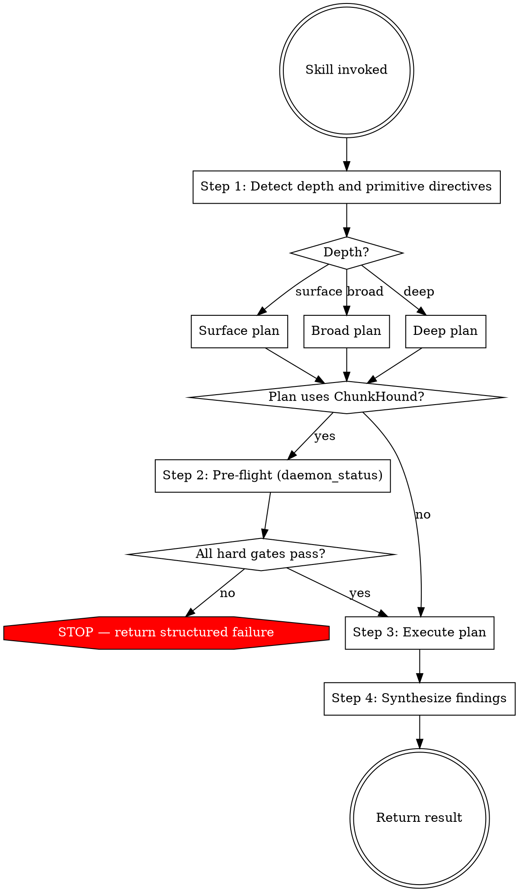

# Researching Code

Execute code research against the ChunkHound index and return synthesized findings. The skill picks the depth, sequences the queries, and returns the result.

## Workflow

### Step 1: Detect depth and primitive directives

Pick **surface**, **broad**, or **deep** in this priority:

1. **Explicit directive from the caller** — phrases like "quick check", "surface", "deep dive", "full trace", "just locate X". Use it verbatim.
2. **Question shape** when no directive — surface for symbol-location questions ("Where is X defined?", "Is X used?", "Show me Y"); broad for subsystem questions ("How does Z work?", "What handles A?"); deep for multi-component traces, impact analyses, and full subsystem audits ("Trace data flow from A through B to C", "Audit all callers", "full impact map for refactoring X").
3. **Default**: broad. Surface drops context; deep wastes time.

Also check for a **primitive directive** — phrases like "use code_research", "research this with synthesis", "run a chunkhound code research", or "force code_research" mark the plan as `code_research`-only. Without such a directive, primitive choice falls to the Step 3 catalog. The primitive directive is orthogonal to depth: a forced `code_research` plan can be surface (one call), broad (1–N calls), or deep (orient + per-POI calls).

Declare the chosen depth and any primitive directive in one line before continuing. Do not skip this step — without an explicit declaration the workflow defaults to whatever the first query looks like, which is not the same thing.

The depth decision is independent of daemon state. Do not consult `daemon_status` here, do not let "the daemon might be slow" shrink the plan. Plan first, then check availability.

### Step 2: Pre-flight (if the plan uses ChunkHound)

Sketch the primitives you'll use from the catalog in Step 3. If any are ChunkHound primitives (`code_research` or `search`), perform the pre-flight check defined in `references/pre-flight.md` before running queries. If the plan is purely native (`Read`, `ugrep`, `bfs`), skip pre-flight and proceed to Step 3.

When pre-flight returns a structured failure: return that failure to the caller and stop. Do not silently downgrade a ChunkHound-dependent plan to native-only — that would silently degrade results for questions that needed synthesis. A plan that was native-only from the start is unaffected.

When pre-flight returns warnings: continue to Step 3 and carry the warnings into the Step 4 "Coverage caveats" section under *Index health notes*.

### Step 3: Execute

For each query in the plan, pick a primitive:

- **Known identifier** (function, class, constant) → `search` regex, or `ugrep` via Bash — no synthesis needed
- **Known literal** (TODO, error message, env var) → `ugrep` via Bash — direct enumeration
- **Known file by path** → `Read` — no search needed
- **Known file pattern** (e.g. all `*.test.ts`) → `bfs` via Bash — filesystem-level
- **Concept with a canonical name** → `search` semantic — ChunkHound's vector match
- **Concept where vocabulary is unknown** → `code_research` — need synthesis to translate intent into code
- **"How does X work end-to-end?" / cross-file flow** → `code_research` — multi-file synthesis is the value
- **Find all callers of X** → `search` regex, or `ugrep` via Bash — enumeration
- **Design pattern or architecture question** → `code_research` — synthesis required

`code_research` is LLM-driven and slow. Reserve it for questions where synthesis is the deliverable. Anything answerable by reading 1–3 chunks should use `search`, `ugrep`, or `bfs`.

**Primitive override.** If Step 1 declared `code_research`-only, every query in the plan uses `code_research` regardless of what the catalog suggests for the question shape. The catalog is still consulted for query *scoping* (whether to use the `path` parameter, how to phrase the prompt), but the primitive choice is fixed.

**Language scope.** ChunkHound only produces semantic chunks for the languages listed in `references/supported-languages.md`. For unsupported languages:

- Run the ChunkHound plan against the supported-language slice as usual.
- When the topic could plausibly touch unsupported-language files (e.g. `.twig` in Shopware, `.erb` in Rails, `.heex` in Phoenix LiveView), run one `bfs` filename scan to confirm presence and surface the extensions and directories as a **Coverage caveat** in Step 4.

Do not `ugrep` or `Read` the unsupported-language files themselves — a word-based search cannot replicate ChunkHound's cross-file synthesis and would mask the gap with shallow findings.

Run the workflow that matches the depth declared in Step 1.

#### Surface workflow

For known symbols, literals, or "is X here?" questions.

1. Pick the primitive from the catalog above.
2. Run the query.
3. Evaluate. If it answers the question → go to Step 4.
4. If not, **one** targeted retry: rephrase, swap primitive (regex ↔ semantic, native ↔ ChunkHound) if the mismatch was vocabulary or scope.
5. If the retry also fails → declare escalation to broad and continue with the Broad workflow. Do not silently keep firing queries.

#### Broad workflow

For "how does X work?" / "what handles A?" questions spanning a subsystem.

1. Decompose the question into 1–N sub-questions if it covers multiple subsystems. If one query can cover everything, do not artificially split it.
2. For each sub-question, pick the primitive from the catalog. Run independent calls in parallel where possible.
3. After each call, evaluate coverage against the original question. Stop early when answered — do not exhaust a pre-planned queue.
4. If a sub-question keeps returning fragmentary results, that branch is a Point of Interest candidate — escalate only that branch to the Deep workflow while finishing the others normally.

#### Deep workflow

For multi-component traces, impact analyses, and full subsystem audits.

1. **Orient** — one `code_research` call with a broad framing. Use the `path` parameter only if the question is already scoped to a subdirectory. Goal here is a map, not an answer.
2. **Extract Points of Interest** — from the orient output, list 2–6 specific files, symbols, or subsystems that need closer inspection. Write the list explicitly before running any follow-up query. Skipping this step lets follow-ups drift away from the original question.
3. **Focus** — for each POI, pick the primitive from the catalog (symbol-level → `search` or native text search; sub-flow → `code_research` with `path` scoped to the POI's directory). Run independent POI queries in parallel.
4. **Synthesize** — combine the orient map with the per-POI findings in Step 4.

### Step 4: Synthesize and return

Structure findings as below. Scale the prose to match the depth: surface returns can be compact; broad and deep returns use every section.

#### Overview
2–3 sentences directly answering the question.

#### Key Components
- `path/to/file.ext:42` — what this component does
- `path/to/other.ext:108` — related functionality
- [continue with relevant files…]

#### Architecture Insights
How components relate. Data flows, design patterns, dependency relationships, integration points. Omit for surface findings when there is nothing structural to say.

#### Recommendations
Next steps: areas to explore further, files to read in detail, questions to clarify. Omit for surface findings.

#### Coverage caveats
Limits on the findings above. Include only what applies; omit the section entirely when neither bullet applies.

- **Unsupported-language gaps.** If the research topic could touch file types not in `references/supported-languages.md` and a `bfs` filename scan confirmed such files exist in the project, list those extensions and the directories where they appear. Do not summarize their contents — the caller decides whether to investigate further. Phrase as a missing slice ("`.twig` templates under `src/Resources/views/` were not searched"), not as a softening of the supported-slice findings.
- **Index health notes.** Any pre-flight warnings from Step 2, verbatim.
