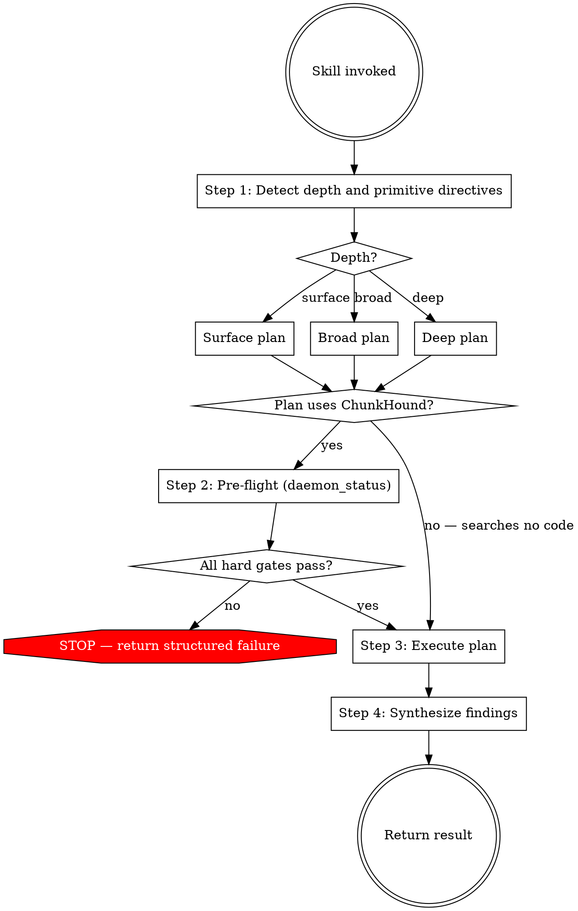

# Researching Code

Execute code research against the ChunkHound index and return synthesized findings. The skill picks the depth, sequences the queries, and returns the result.

## Workflow

### Step 1: Detect depth and primitive directives

Pick **surface**, **broad**, or **deep** in this priority:

1. **Explicit directive from the caller** — phrases like "quick check", "surface", "deep dive", "full trace", "just locate X". Use it verbatim.
2. **Question shape** when no directive — surface for symbol-location questions ("Where is X defined?", "Is X used?", "Show me Y"); broad for subsystem questions ("How does Z work?", "What handles A?"); deep for multi-component traces, impact analyses, and full subsystem audits ("Trace data flow from A through B to C", "Audit all callers", "full impact map for refactoring X").
3. **Default**: broad. Surface drops context; deep wastes time.

Also check for a **primitive directive** — phrases like "use code_research", "research this with synthesis", "run a chunkhound code research", or "force code_research" mark the plan as `code_research`-only. Without such a directive, primitive choice falls to the Step 3 catalog. The primitive directive is orthogonal to depth: a forced `code_research` plan can be surface (one call), broad (1–N calls), or deep (orient + per-POI calls).

Declare the chosen depth and any primitive directive in one line before continuing. Do not skip this step — without an explicit declaration the workflow defaults to whatever the first query looks like, which is not the same thing.

The depth decision is independent of daemon state. Do not consult `daemon_status` here, do not let "the daemon might be slow" shrink the plan. Plan first, then check availability.

### Step 2: Pre-flight (if the plan uses ChunkHound)

Sketch the primitives you'll use from the catalog in Step 3. If any are ChunkHound primitives (`code_research` or `search`), perform the pre-flight check defined in `references/pre-flight.md` before running queries. Skip pre-flight only when the plan searches no code — a known-path `Read` and a path-pattern `bfs` both qualify, because neither consults the index. Every plan that searches code reaches the gate, because a ChunkHound primitive opens it.

When pre-flight returns a structured failure: return that failure to the caller and stop. Do not downgrade to `ugrep` or `bfs` and answer anyway — an unavailable index means the research did not happen, and a word-based substitute would return shallow findings under the appearance of a completed search.

When pre-flight returns warnings: continue to Step 3 and carry the warnings into the Step 4 "Coverage caveats" section under *Index health notes*.

### Step 3: Execute

For each query in the plan, pick a primitive. A ChunkHound primitive opens every *code* search; `ugrep` only ever closes one. Matching file paths is not searching code, so `Read` and `bfs` stand outside this rule.

- **Concept, behavior, or "where does X happen"** → `search` semantic — the default whenever the exact token is not already known
- **Relationship or impact question about a known symbol** ("what calls X", "what breaks if X changes") → `search` semantic — the symbol being known does not make the question lexical
- **Exact occurrence or definition of a known string** (where a constant is declared, every literal `TODO`, a specific error message) → `search` regex
- **Design pattern, cross-file flow, or unknown vocabulary** → `code_research` — multi-file synthesis is the deliverable
- **Known file by path** → `Read` — this is not a search
- **Known file pattern** (all `*.test.ts`, every `Migration*.php`) → `bfs` via Bash — this enumerates paths, not code; no ChunkHound primitive searches paths, so nothing has to precede it
- **Exhaustive enumeration after a ChunkHound query has located the surface** (confirming every call site of a symbol slated for refactoring) → `ugrep` via Bash
- **Documentation content (Markdown)** → `bfs` to locate, `Read` to consume — governed by the `Documentation scope` rule below; never evidence on its own

**Prefer semantic over regex.** Regex matches the token you guessed; semantic matches the code you meant. Choose regex only when the deliverable is occurrences of a string you already know exactly. Knowing a symbol's name is not sufficient grounds for regex — if the question is about what that symbol relates to, it is a semantic question.

**`ugrep` is a complement, never an opener.** Do not start a query with `ugrep` because the question looks trivial. A word-based search reports occurrences of a string — not indirect callers, dynamic dispatch, container wiring, or string-keyed references, which is precisely the surface a refactoring must cover. Establish that surface with `search` or `code_research`, then use `ugrep` to confirm the enumeration is exhaustive. (`bfs` is exempt: matching paths is not searching code. Markdown-confined `ugrep` under the `Documentation scope` rule is likewise exempt: documentation content is not code.)

Where the deliverable is an exhaustive list — every call site, every usage, an impact map — that closing sweep is mandatory at every depth, including surface. Such a query is not answered until both halves have run, whatever the caller's "quick check" phrasing suggested.

`code_research` is LLM-driven and slow. Reserve it for questions where synthesis is the deliverable; anything answerable by reading 1–3 chunks uses `search`.

**Primitive override.** If Step 1 declared `code_research`-only, every query in the plan uses `code_research` regardless of what the catalog suggests for the question shape. The catalog is still consulted for query *scoping* (whether to use the `path` parameter, how to phrase the prompt), but the primitive choice is fixed. The override governs which primitive answers a question; it does not cancel the closing `ugrep` sweep, which verifies an answer rather than producing one.

**Language scope.** ChunkHound only produces semantic chunks for the languages listed in `references/supported-languages.md`. For unsupported languages:

- Run the ChunkHound plan against the supported-language slice as usual.
- When the topic could plausibly touch unsupported-language files (e.g. `.twig` in Shopware, `.erb` in Rails, `.heex` in Phoenix LiveView), run one `bfs` filename scan to confirm presence and surface the extensions and directories as a **Coverage caveat** in Step 4.

Do not backfill the gap by `ugrep`-ing or reading the contents of those files — a word-based search cannot replicate ChunkHound's cross-file synthesis and would mask the gap with shallow findings. This bounds what you may do *about* a coverage gap; a caller who names a specific file still gets it read.

**Documentation scope.** Markdown files are documentation: secondary evidence, prone to drift, and often deliberately excluded from the project's index. Consult documentation relevant to the research topic at every depth (except bare location or enumeration lookups that no prose could inform) and weight it below code: any doc-derived claim entering the findings is corroborated against code and labeled, per `references/documentation-scope.md`. Locating docs (`bfs`, or `ugrep` confined to Markdown files when filenames alone cannot identify relevance) and reading them (`Read`) stand outside the ChunkHound-opener rule and the pre-flight gate — documentation content is not code. Documentation never substitutes for the ChunkHound plan and never backfills an empty code result.

Run the workflow that matches the depth declared in Step 1.

#### Surface workflow

For known symbols, literals, or "is X here?" questions.

1. Pick the primitive from the catalog above.
2. Run the query.
3. Evaluate. If it answers the question → **Sweep**, below. An enumeration question is not answered until its closing `ugrep` sweep has run, however quick the caller asked for it to be.
4. If it does not answer the question, **one** targeted retry: rephrase, or swap primitive (regex → semantic, `search` → `code_research`) if the mismatch was vocabulary or scope.
5. If the retry also fails → declare escalation to broad and continue with the Broad workflow. Do not silently keep firing queries.
6. **Sweep** — where the deliverable is an exhaustive list, run the closing `ugrep` sweep and reconcile it against the ChunkHound result. Then go to Step 4 (Synthesize).

#### Broad workflow

For "how does X work?" / "what handles A?" questions spanning a subsystem.

1. Decompose the question into 1–N sub-questions if it covers multiple subsystems. If one query can cover everything, do not artificially split it.
2. For each sub-question, pick the primitive from the catalog. Run independent calls in parallel where possible.
3. After each call, evaluate coverage against the original question. Stop early when answered — do not exhaust a pre-planned queue. A sub-question whose deliverable is an exhaustive list counts as answered only once its closing `ugrep` sweep has run.
4. If a sub-question keeps returning fragmentary results, that branch is a Point of Interest candidate — escalate only that branch to the Deep workflow while finishing the others normally.

#### Deep workflow

For multi-component traces, impact analyses, and full subsystem audits.

1. **Orient** — one `code_research` call with a broad framing. Use the `path` parameter only if the question is already scoped to a subdirectory. Goal here is a map, not an answer.
2. **Extract Points of Interest** — from the orient output, list 2–6 specific files, symbols, or subsystems that need closer inspection. Write the list explicitly before running any follow-up query. Skipping this step lets follow-ups drift away from the original question.
3. **Focus** — for each POI, pick the primitive from the catalog (symbol-level → `search`; sub-flow → `code_research` with `path` scoped to the POI's directory). Run independent POI queries in parallel. Where the deliverable is an exhaustive list — an impact map for a refactoring — close each POI with a `ugrep` sweep to confirm the ChunkHound findings missed nothing.
4. **Synthesize** — combine the orient map with the per-POI findings in Step 4.

### Step 4: Synthesize and return

Structure findings as below. Scale the prose to match the depth: surface returns can be compact; broad and deep returns use every section.

#### Overview
2–3 sentences directly answering the question.

#### Key Components
- `path/to/file.ext:42` — what this component does
- `path/to/other.ext:108` — related functionality
- [continue with relevant files…]

#### Architecture Insights
How components relate. Data flows, design patterns, dependency relationships, integration points. Omit for surface findings when there is nothing structural to say.

#### Recommendations
Next steps: areas to explore further, files to read in detail, questions to clarify. Omit for surface findings.

#### Documentation evidence
Doc-derived claims, when documentation was consulted. Each claim carries its corroboration label from `references/documentation-scope.md` — **Corroborated** (cited to code), **Uncorroborated**, or **Contradicted** (suspected drift: doc statement and code evidence, both cited). The code-evidence sections above never carry doc-derived claims. Omit the section when no documentation was consulted.

#### Coverage caveats
Limits on the findings above. Include only what applies; omit the section entirely when no bullet applies.

- **Unsupported-language gaps.** If the research topic could touch file types not in `references/supported-languages.md` and a `bfs` filename scan confirmed such files exist in the project, list those extensions and the directories where they appear. Do not summarize their contents — the caller decides whether to investigate further. Phrase as a missing slice ("`.twig` templates under `src/Resources/views/` were not searched"), not as a softening of the supported-slice findings.
- **Documentation index status.** When documentation was consulted and no Markdown chunks surfaced from the index (per `references/documentation-scope.md`), say so: documentation was reached by direct read, not through the index.
- **Index health notes.** Any pre-flight warnings from Step 2, verbatim.
