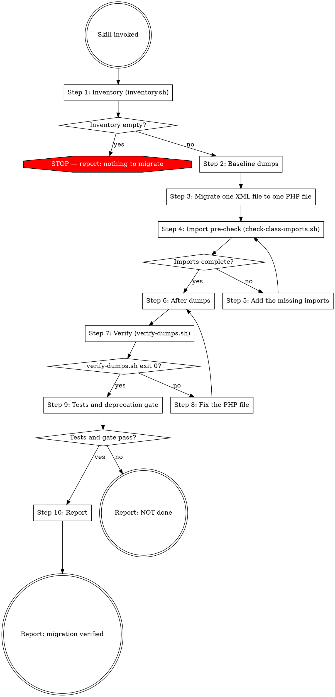

# Migrate Shopware Extension XML Configuration to PHP

Shopware 6.7 deprecates loading Symfony configuration from XML for bundles and plugins; Shopware 6.8 removes it, because Symfony 8 drops the XML loaders entirely. Extensions that still ship XML config break with 6.8.

The migration is mechanical and behavior-neutral: the compiled container and route collection stay identical apart from what `verify-dumps.sh` classifies as inert. A tool-computed verdict is the only verdict that enters the report.

## Scope

| In scope | Out of scope (Shopware-specific XML formats — keep as XML) |
|---|---|
| `src/Resources/config/services.xml`, `services_test.xml` | `Resources/config/config.xml` (plugin settings) |
| `src/Resources/config/routes.xml`, `routes_<env>.xml`, `routes_overwrite.xml`, any XML under `Resources/config/routes/` | `Resources/config/custom-fields.xml`, `flow.xml`, `rule-conditions.xml` |
| `src/Resources/config/packages/**/*.xml` | App `manifest.xml` |

`packages/**` config is loaded only by a bundle that calls `buildDefaultConfig()`, which in Shopware is its own core bundles and nothing else; a plugin's packages files are inert unless the extension loads them itself. They stay in scope regardless — dead XML is still XML that has to be gone before 6.8 — but nothing in this workflow can observe their content, so Step 7 and Step 10 treat a packages row differently from every other row.

## Prerequisites

- A working Shopware installation (6.6+) with the extension installed and active, and `bin/console` working. Run every console command through the project's development environment.
- `jq` available on the host for `verify-dumps.sh`.
- The dump directory and the extension sources readable from where the bundled scripts run.

`${CLAUDE_SKILL_DIR}` is this skill's own directory; on a host that does not define it, substitute the path to this skill's directory.

## Workflow



### Step 1: Inventory

```
bash "${CLAUDE_SKILL_DIR}/scripts/inventory.sh" <extension-src-root>
```

The script emits one TSV row per in-scope XML file: `path<TAB>type<TAB>envs`. `type` is `services`, `routes`, or `packages`. `envs` is a comma-separated list. Location decides how it is derived: a file directly in `Resources/config` takes its env from a filename suffix (`services_test.xml`, `routes_<env>.xml`); a file under a `routes/` or `packages/` subdirectory instead takes its env from that subdirectory's name (e.g. `routes/dev/api.xml`, `packages/test/monolog.xml`, including a file nested further below it), and the filename contributes nothing there — a file directly under `routes/` or `packages/` with no subdirectory is `default`. Each `<when env="X">` occurrence appends `X` on top of that.

A file whose basename and location match no rule is classified by its own content: a Symfony DI namespace makes it `services`, a Symfony routing namespace makes it `routes`, both at env `default` — such a file is loaded by hand under a name of the author's choosing, so the filename contributes nothing. An XML carrying neither namespace is out of scope: it is announced on stderr as `skipped (not Symfony DI or routing XML)`, left out of the TSV, and the run continues. That notice belongs to the content classifier alone. The five Shopware-native basenames in the Scope table are dropped earlier and silently, by name, whenever they sit directly in a `Resources/config` directory — they are documented scope rather than a finding, so no notice names them, and their absence from both the TSV and stderr is the expected result. Exit 2 means invalid invocation, or a scan failure such as an unreadable file or directory; fix the arguments or the environment and rerun.

Pass the extension's whole `src` tree, not just its top-level config directory: a plugin registering extra bundles through `getAdditionalBundles()` carries config in each bundle's own `Resources/config`.

Empty output with exit 0 means there is nothing to migrate: report that and stop. An installation whose extensions carry no in-scope XML, or that has no extension at all, reaches the same result and gets the same report.

The union of the `envs` column is the env list every later step runs against.

### Step 2: Baseline dumps

Run this before the first edit. Every env in the Step 1 union list gets its full set of four dumps — `verify-dumps.sh` refuses a missing one in Step 7. For every env, one env at a time, clear the cache and then take the four dumps, in this order:

| Order | Console command | Captured to |
|---|---|---|
| 1 | `cache:clear` | — |
| 2 | `debug:container --format=json` | `var/xml-migration/before-services-<env>.json` |
| 3 | `debug:container --format=json --show-hidden` | `var/xml-migration/before-hidden-<env>.json` |
| 4 | `debug:container --format=json --parameters` | `var/xml-migration/before-params-<env>.json` |
| 5 | `debug:router --format=json` | `var/xml-migration/before-routes-<env>.json` |

Every console command in this workflow names its target environment explicitly, as part of the command invocation itself — on every command in the table, `cache:clear` included: the `--env=<env>` argument, or a runner's equivalent structured environment parameter. Never deliver the environment as a process variable set where the command is launched: the command's own arguments always reach the console, while a variable is not guaranteed to cross the layers in between, and the dumps then come from the wrong environment. The env labeled `default` means the opposite instruction — select no environment at all — and the literal name `default` is never passed as one: the kernel boots that nonexistent environment happily, loads no env-specific config, and exits 0. Step 7 refuses dumps whose recorded kernel environment contradicts the env their filename claims.

`cache:clear` may print advisory lines of its own (a "cache is fresh"-style message, for instance); they are not evidence of anything, and the Step 7 dump diff is the only evidence this workflow reads.

Send each dump's stdout to its target file, by whatever means the session offers — a runner that writes command output to a file, or redirection. Never read the dump bytes back into the conversation. A failed command must leave no partial or stale target: stop, fix the environment, re-take that dump, and never continue with an incomplete set.

`--show-hidden` is exclusive, not additive; both container dumps are required because decorated inner services get hidden `.`-prefixed ids.

Before and after must run on the same installation, database, and plugin state.

### Step 3: Migrate one XML file to one PHP file

Apply the rules and translation table in references/xml-to-php-translation.md. Four invariants hold:

1. Same directory, same basename: `services.xml` → `services.php`, `services_test.xml` → `services_test.php`, `routes.xml` → `routes.php`. Package XML may go to YAML or PHP.
2. Delete the XML file in the same change. The plugin system globs `services.*` and loads every match — with both present, both load and the XML silently wins on collision.
3. Convention-discovered files need no loader or bundle-class change: `Bundle::registerContainerFile()`, `configureRoutes()`, and `buildDefaultConfig()` already discover `.php` and `.yaml` files. Where the plugin loads XML manually (an `XmlFileLoader` in `Plugin::build()`, or a bundle's `loadExtension()`), replace that `$loader->load('....xml')` line with a `PhpFileLoader` equivalent at the same position — load order is behavior.
4. Preserve 1:1: service ids, class names, argument values and order, tags with all attributes and priorities, method calls, factories, configurators, decoration (priority + on-invalid), public/private, lazy, shared, synthetic, abstract, deprecations, aliases, parameters, `<defaults>`. Change nothing beyond the format — no added autowiring, renamed ids, reordering, merged or split files, added or removed services.

### Step 4: Import pre-check

```
bash "${CLAUDE_SKILL_DIR}/scripts/check-class-imports.sh" <file.php>...
```

Pass every migrated PHP file. A bare `Foo::class` without a matching `use` resolves against the config file's own namespace — no parse error, just a wrong service id. Exit 0 means every referenced class is imported; exit 1 lists the missing ones; exit 2 is invalid invocation or a scan failure.

### Step 5: Add the missing imports

Add a `use` statement for each class the pre-check named. Import aliases resolve name collisions; global classes keep their leading backslash. Do not silence the check by inlining an FQCN string.

### Step 6: After dumps

Repeat the Step 2 commands, in the same order, for the same envs, writing `var/xml-migration/after-{services,hidden,params,routes}-<env>.json` instead of the `before-*` targets. Every invariant from Step 2 holds here: the environment selected as in Step 2, on the command itself rather than as a variable in front of it (and no environment selected for `default`), dump output to the file rather than into the conversation, a failed command stopping the run instead of leaving a partial set, and a `cache:clear` advisory line proving nothing either way.

Then establish that the container actually rebuilt from the migrated files, before reading any dump. A container that was not rebuilt still describes the XML-era configuration, so its after dumps match the before dumps exactly and Step 7 reports `identical` — the passing result — for a migration it never saw. Cache advisory output does not settle this either way, so the evidence has to come from the compiled container itself: inspect the freshest compiled-container metadata for the environment — Shopware keeps sibling cache directories per environment (`var/cache/<env>_h<hash>/`, the hash varying with the plugin set), so pick the newest sibling by mtime, and in it the compiled container's `.meta.json` or whichever tracked-resources list sits beside the compiled container — and confirm it references the migrated `.php` files by name and no longer references the specific `.xml` files this migration deleted. Match the exact migrated filenames, not any `.xml` under the extension: the tracked-resources list also records negative existence probes, so paths like `serialization.xml` or `validation.xml` appear for files that never existed, and a bare `.xml` grep flags a passing run. Read the cache metadata for this and never the dump files, which are the thing being validated. Metadata still tracking the XML means the rebuild did not happen and the after dumps are stale: clear the cache, re-take the after dumps for that env, and check again. Metadata that cannot be located or read leaves the rebuild unconfirmed — say so in the report rather than letting Step 7's `identical` stand in for it.

The `before-*` dumps are immutable once the migration starts and are never re-taken.

### Step 7: Verify

```
bash "${CLAUDE_SKILL_DIR}/scripts/verify-dumps.sh" var/xml-migration <extension-src-root> <envs-csv>
```

Pass the same env union as Steps 2 and 6.

The script checks that every env in the csv has all eight dumps, reads `kernel.environment` out of each env's before and after parameter dumps and holds them to the env their filename claims, normalizes each dump with sorted object keys — array order (tags, arguments) is behavior and stays as emitted — diffs every before/after pair, classifies each diff, runs the XML/replacement coexistence check and the leftover-`.xml`-reference grep, and prints the markdown verification table for the report.

The kernel-environment check covers the csv's envs only, since a stray discovered pair claims no env. It refuses three things: a before and after that disagree with each other, a named env whose dumps record a different kernel environment, and a `default` pair recording the literal `default` — the tell that the dumps were taken with `default` passed as a literal environment name rather than with no environment selected at all. The `default` row therefore accepts whatever kernel environment the installation actually boots, whichever name that is, and only requires the before and after dumps to record the same one; a named env row has to match its own name exactly.

- Exit 0 — every pair identical or inert.
- Exit 1 — a real diff, a surviving XML/replacement pair, or a leftover `.xml` reference.
- Exit 2 — invalid invocation, a missing dump from the required set, a dump that is not valid JSON, a missing counterpart dump, a parameter dump recording no `kernel.environment`, a recorded kernel environment contradicting its counterpart or its filename, or an environment/scan failure.

Inert means one thing only: hidden service ids belonging to anonymous inline services, which the XML loader hoists to `.N_ClassName~hash` while `inline_service()` keeps them inline in the argument. The script decides what is inert. A diff that looks harmless but the script reports as DIFFERS is a migration bug.

The dump diff cannot validate a packages migration in a plugin. Nothing loads a plugin's packages config, so its services never reach the container and the before and after dumps are identical whatever those files contain — an untouched packages XML, a faithful translation and a wrong translation all produce the same passing row. The Step 9 deprecation gate does not cover them either: the deprecation is raised by the same loader that never runs for a plugin, so a stray packages XML leaves the gate at exit 0 while a stray `services_test.xml` throws. A packages row is verified by reading the new PHP or YAML line by line against the XML it replaces, using the translation reference — not by these instruments — and the report says so.

### Step 8: Fix the PHP file

Edit the PHP configurator until the dump matches. Never edit the `before-*` dumps, re-take the baseline, or relax what counts as inert.

### Step 9: Tests and deprecation gate

1. Run the extension's own test suite (PHPUnit; Jest/E2E where config-relevant) and its static analysis and code style tools where configured. A suite counts as passing only when it executed a nonzero number of tests: an empty suite exits 0 and reports that no tests were executed, which is not a pass. Record a suite that executed zero tests, and an extension that has no test suite at all, as `absent` / `0 tests` in the report — never as passing. A suite that starts but cannot execute — a bootstrap crash, a broken test database — is a distinct outcome: record it as `suite could not execute — <reason>`; it ends at "Report: NOT done" only when the cause is the migration, and a pre-existing, migration-unrelated cause is recorded with its reason instead of being folded into `absent` or into a failure.
2. `cache:clear` succeeds with `FEATURE_ALL=major` in the console process's environment. With the major flag, remaining XML config throws instead of logging, so a clean exit is itself the deprecation check — nothing separate has to be read out of a log. Deliver the variable by whatever mechanism your runner provides for setting a variable in the command's own process environment. Delivery is never assumed: a variable set where the command is launched can fail to reach the console process, and the gate then succeeds while testing nothing — which is exactly what the control below exists to rule out.

   Prove the instrument before trusting it, once per run: place a temporary empty `services_test.xml` in the extension's `Resources/config`, run the same gate, and confirm it throws `The XML configuration file "..." ... is deprecated` naming that file; delete the file, then run the real gate for every migrated environment. A control that does not throw means the gate is blind — the flag never reached the process, or the wrong extension is under test — and no clean result from it counts until that is fixed.

   Where the flag cannot run, fall back to the deprecation surface a plain `cache:clear` writes to: the environment's log file (`var/log/<env>.log`) and the console command's own output, searched for `The XML configuration file "..." ... is deprecated` naming this extension. A quiet or absent log is weak evidence — it does not separate a clean result from an instrument that never wrote anything — so a fallback that finds nothing records the gate as not checked, with the reason, rather than passing it on silence.

Run the test suite only once both dump phases are complete. A test bootstrap may install and activate the extension as a side effect of starting the suite, which writes to the database and changes the very installation state Step 2 requires to be identical for the before and after dumps. Never take a dump, or re-take one, after the suite has run.

A failure here ends at "Report: NOT done". Say so plainly instead of softening the result.

### Step 10: Report

Paste the whole Step 7 output verbatim — the table and every line under it, the coexistence, leftover-reference and `Inert diffs:` lines included. Do not retype, summarize, or upgrade a row. Below that block only three lines are hand-authored: the packages line, the tests line, and the deprecation-gate line.

The packages line is written only when the inventory listed a packages file, and it never claims more than the instruments delivered: those rows are migrated and reviewed by hand, unverified by the dumps and the gate. Report the rebuild check from Step 6 the same way — an unconfirmed rebuild is stated as unconfirmed, never folded into the table's verdict.

A run that stopped at "nothing to migrate" reports two things and nothing else: the root that was scanned, and the inventory result including any file the scan announced as skipped. It carries no verification table, because Steps 2 to 9 never ran.

```markdown
## XML → PHP configuration migration: <ExtensionName>

| File | Type | Migrated to | Env |
|---|---|---|---|
| src/Resources/config/services.xml | services | services.php | default |
| ... | | | |

### Verification
<verify-dumps.sh output, verbatim: table, coexistence, leftover-reference and Inert diffs lines>

Packages rows: migrated, manual review (not loaded by plugins — instruments cannot verify)
Tests: <suite, count, result>
Deprecation gate (FEATURE_ALL=major cache:clear): <ok | not checked (reason)>
```
