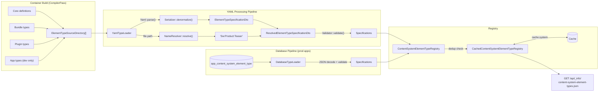
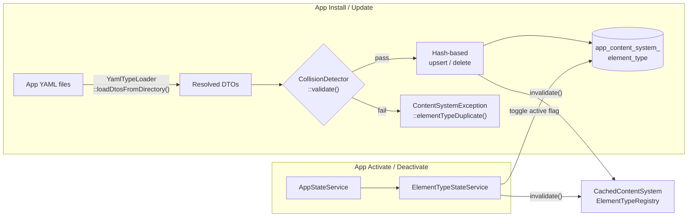

# Feature-Branch PR Description Examples by Size

Use these examples to calibrate description length and structure. Size is determined by explanation complexity, not diff size. A 3-file refactor that replaces one extension mechanism with another is small. A 20-file feature with a new compiler pass, registry, and API endpoint is large.

## Small (~2 paragraphs, 2 subsections)

Brief, single-concern changes. Opening paragraph + 2 focused subsections.

### Example — Event replaces ServiceLocator for type override

**Title:** `refactor(content-system): replace ServiceLocator with event for type override`

```markdown
`ContentSystemDataLoaderTypeResolver` used a `ServiceLocator` to call `overrideProvidedTypes()` on individual data loaders at resolve time. This coupled the resolver to the loader instances and placed an override hook on the abstract base class that only two loaders used. This PR replaces the mechanism with a dispatched event, aligning type override extensibility with Shopware's event-based extension pattern.

### Event-based type override

`ContentSystemDataLoaderTypesResolvedEvent` is dispatched per source after the resolver hydrates compile-time type descriptors. The event carries the `source` identifier and a mutable `types` array. Listeners subscribe to a source-specific event name (`ContentSystemDataLoaderTypesResolvedEvent::class . '.' . $source`) via `#[AsEventListener]`, keeping dispatch targeted.

`EntityLoader` and `EntityCollectionLoader` replace their `overrideProvidedTypes()` implementations with `onTypesResolved()` listener methods that populate `$event->types` with all registered entity/collection classes, matching the previous behavior.

### Removed abstractions

`overrideProvidedTypes()` and its default no-op implementation are removed from `AbstractContentDataLoader`. The resolver drops its `ServiceLocator` dependency in favor of `EventDispatcherInterface`, and its DI registration switches from named to positional constructor arguments. Test stub loader classes (`ReplacingStubLoader`, `NoOpStubLoader`, `EmptyOverrideStubLoader`) are replaced by inline event listener closures.

## References

Blocked by #15855
```

Why this is small: one mechanism replaced with another. The opening paragraph explains the coupling problem, two subsections cover the new event and the cleanup. No tables needed, no diagram warranted.

### Example — Review feedback fixes

**Title:** `fix(content-system): address review feedback for data loader type introspection`

```markdown
Review feedback on #15622 identified two issues: the `overrideProvidedTypes` contract used pass-by-reference mutation that confused callers, and the API route was missing its OpenAPI schema definition.

### Return-value contract for `overrideProvidedTypes`

Replaced pass-by-reference mutation (`array &$types): void`) with a return-value contract (`array $compiledTypes): array`). The previous signature pre-populated the parameter and then let wildcard loaders discard it entirely, which made the data flow hard to follow. Added edge case tests for mixed-source resolution and empty override returns.

### OpenAPI schema for type endpoint

Renamed the route from `content-system-data-loader-type-schema.json` to `content-system-data-loader-types.json` and added the OpenAPI schema definition. Route removed from `routes_without_schema` snapshot.

## References

Follows #15622
Follow-up: #15860
```

Why this is small: two independent fixes from review feedback. Each gets its own subsection, but neither needs extended explanation. The opener states which PR prompted the work.

## Medium (~3 paragraphs, 3-4 subsections, tables)

Multi-file changes following established patterns. Tables for structured mappings.

### Example — Domain data loaders following triplet pattern

**Title:** `feat(content-system): add content data loaders to domain modules`

```markdown
The ContentSystem's hydration pipeline needed domain-specific data loaders to bridge it to existing Store API routes. Each loader follows the triplet pattern (`DataLoader`, `LoaderConfig`, `LoaderConfigSerializer`) established in #15404 and is co-located with its owning domain module.

### New loader triplets

| Loader | Domain module | Delegates to |
|---|---|---|
| Breadcrumb | `Content/Breadcrumb/ContentSystem/DataLoader/` | `AbstractBreadcrumbRoute` |
| ServiceMenu | `Content/Category/ContentSystem/DataLoader/` | `NavigationLoaderInterface` |
| CrossSelling | `Content/Product/ContentSystem/DataLoader/` | `AbstractProductCrossSellingRoute` |
| ProductReview | `Content/Product/ContentSystem/DataLoader/` | `AbstractProductReviewRoute` |
| ProductSearch | `Content/Product/ContentSystem/DataLoader/` | `AbstractProductSearchRoute` |
| ProductSuggest | `Content/Product/ContentSystem/DataLoader/` | `AbstractProductSuggestRoute` |

Each data loader reads element properties to resolve entity IDs, delegates to its route, and returns the result wrapped in `ContentDataLoaderResult`. Config serializers throw their domain's exception class (e.g., `ProductException`, `CategoryException`, `BreadcrumbException`) for validation failures.

### Error handling and request isolation

ServiceMenu and ProductReview loaders catch route exceptions (`CategoryNotFoundException`, `ProductException`, `ReviewNotActiveExeption`) and return `notFound` results instead of propagating errors. ProductSearch and ProductSuggest loaders create a fresh `Request` for their route calls, preventing query parameters (`limit`, `p`, `order`) from the original request leaking into the delegated route.

### DI registrations

Service registrations are added to each domain's existing DI file (`breadcrumb.xml`, `category.xml`, `product.xml`) with `content_system.data_loader` and `content_system.config_serializer` tags, consistent with the decentralized DI pattern from #15404.

### Coverage exclusions

`LoaderConfig` DTOs are excluded from PHPUnit code coverage in `phpunit.xml.dist`, matching the existing exclusion for framework-level loader configs.

## References

Ref #15576
```

Why this is medium: follows an established triplet pattern, so the structure is predictable. The table maps all new loaders at a glance. Two subsections cover non-obvious decisions (error handling, request isolation). The opening connects to the predecessor PR.

### Example — Decentralize domain classes and DI

**Title:** `refactor(content-system): decentralize domain classes and DI to owning modules`

```markdown
Follows the distribution pattern established by #15262, which co-located entity definitions and specification sources with their owning domain modules. This PR applies the same pattern to domain data loaders, config serializers, and their DI service registrations.

### Class moves

| Loader triplet | From | To |
|---|---|---|
| Currency | `Framework/ContentSystem/Hydration/DataLoader/CurrencyLoader/` | `System/Currency/ContentSystem/DataLoader/` |
| Language | `Framework/ContentSystem/Hydration/DataLoader/LanguageLoader/` | `System/Language/ContentSystem/DataLoader/` |
| Navigation | `Framework/ContentSystem/Hydration/DataLoader/NavigationLoader/` | `Content/Category/ContentSystem/DataLoader/` |
| PaymentMethod | `Framework/ContentSystem/Hydration/DataLoader/PaymentMethodLoader/` | `Checkout/Payment/ContentSystem/DataLoader/` |
| ProductListing | `Framework/ContentSystem/Hydration/DataLoader/ProductListingLoader/` | `Content/Product/ContentSystem/DataLoader/` |
| ShippingMethod | `Framework/ContentSystem/Hydration/DataLoader/ShippingMethodLoader/` | `Checkout/Shipping/ContentSystem/DataLoader/` |

Each triplet consists of `DataLoader`, `LoaderConfig`, and `LoaderConfigSerializer`. Entity-agnostic loaders (`EntityLoader`, `EntityCollectionLoader`), abstract base classes, providers, and result DTOs remain in Framework.

### DI decentralization

Service registrations for domain-owned classes (entity definitions, data loaders, config serializers, specification sources) moved from the central `content-system.xml` to their owning domain's DI file. Tagged services (`content_system.data_loader`, `content_system.config_serializer`, `content_system.context_factory`) are resolved via `tagged_locator`/`tagged_iterator` at compile time regardless of which XML file defines them, so this is a pure organizational change with no runtime impact. `content-system.xml` now contains only framework-owned infrastructure.

### Domain exceptions

Config serializers now throw their domain's exception class (e.g., `ProductException`, `PaymentException`) instead of `ContentSystemException`.

`CurrencyException` was added as it did not exist yet.

## References

Ref #15576
```

Why this is medium: the table is the core of the description (where classes moved). Two prose subsections explain the DI change (pure organizational, no runtime impact) and the exception change. The opener immediately connects to the predecessor.

## Large (~6+ paragraphs, 6+ subsections, tables, potentially diagrams)

New subsystems with multiple integration points. Diagrams justified when the reviewer would understand better by seeing it than reading about it.

### Example — Runtime type introspection for content data loaders

**Title:** `feat(content-system): add runtime type introspection for content data loaders`

```markdown
The Admin UI will need to know which data types each content data loader can deliver, e.g. to populate a compatibility dropdown when configuring content elements. This type information already exists as `@extends AbstractContentDataLoader<T>` PHPDoc annotations on every loader, but only PHPStan could consume it. This PR makes it available at runtime by parsing those annotations at container build time, collecting the results into a flat registry, and exposing them through an Admin API endpoint.

### Reusing PHPDoc as the single source of truth

Rather than introducing a second declaration mechanism (a new abstract method, a PHP attribute, or a config file), the type introspection piggybacks on the `@extends` annotations that already exist for static analysis. `AbstractContentDataLoader::getProvidedData()` uses `phpstan/phpdoc-parser` to extract the `@extends` AST node and `symfony/type-info`'s `TypeContext` to resolve short class names to FQCNs against the loader's `use` imports. Adding a new domain loader automatically makes its type discoverable, so developers only maintain one annotation. `phpstan/phpdoc-parser` moves from `require-dev` to `require` (bumped to `^2.3.0`) since parsing now happens at container build time rather than only during analysis.

All domain data loaders now carry `@extends` annotations. Most declare concrete types like `Tree`, `CategoryCollection`, or `ProductListingResult`. `ProductReviewDataLoader` uses a nested generic (`EntitySearchResult<ProductReviewCollection>`), which the parser handles by recursing into the generic type parameters.

### Compile-time collection, resolve-time override

`ContentSystemDataLoaderTypeCompilerPass` collects type descriptors from all tagged loaders at build time and injects them into `ContentSystemDataLoaderTypeResolver`. The two-phase split exists because some loaders (like `EntityLoader` and `EntityCollectionLoader`) can serve *any* registered entity type. Their `@extends` annotations declare `Entity` and `EntityCollection<Entity>` respectively, which the default annotation parser handles like any other loader. At resolve time, the resolver pre-populates a type list from the compile-time entries and passes it by reference to `overrideProvidedTypes(array &$types)`. Loaders modify the list in-place to replace, extend, or filter. The default implementation is a no-op, keeping the compile-time types as-is.

### Wildcard expansion

`AbstractContentDataLoader::overrideProvidedTypes(array &$types)` receives the compile-time type list by reference and does nothing by default. `EntityLoader` overrides it to clear and repopulate the list with all registered entity classes (skipping `ArrayEntity`). `EntityCollectionLoader` does the same for collection classes (skipping bare `EntityCollection`). The resolver receives all loader instances via a `ServiceLocator` (tagged locator, same pattern as `DataLoaderProvider`) and delegates to each loader.

The resolver stays fully generic: no knowledge of `Entity::class`, `EntityCollection::class`, or `DefinitionInstanceRegistry`. Extensions can create their own wildcard loaders by overriding `overrideProvidedTypes()`.

### Type narrowing on ContentDataLoaderResult

Adding `@extends` annotations surfaced a type gap: `ContentDataLoaderResult` accepted `Struct|array|null` as data, but loaders always return `Struct` subclasses. The constructor narrows to `?Struct` and the factory methods now accept `Struct` instead of `mixed`. `ContentDataLoaderResult` carries no `@template` parameter because no downstream consumer uses the generic. The hydrator accesses `$result->data` as `?Struct`, and the type introspection system reads `getProvidedData()` independently.

This narrowing also caught a real bug: `EntityCollectionLoader` passed `[]` (a raw array) to `cached()` for empty results. These call sites now construct a properly typed empty collection via `$definition->getCollectionClass()`, extracted into a private `emptyCollectionResult()` helper.

`ContentSystemDataLoaderTypeMap` builds a reverse index (`className -> list<source>`) in its constructor so that `getSourcesFor()` lookups are O(1) rather than iterating all sources and descriptors per call.

### API endpoint

`GET /api/_info/content-system-data-loader-type-schema.json` follows the same pattern as the existing `entity-schema.json` endpoint, with caching on the resolver rather than the schema generator: `CachedContentSystemDataLoaderTypeResolver` decorates `ContentSystemDataLoaderTypeResolver` via `cache.object`, matching the `Abstract*/Cached*` convention used elsewhere (e.g. `AbstractSystemConfigLoader`). The schema generator is a plain `@final` class that transforms the cached map into a `{ sources: { [sourceId]: { types: [...] } } }` structure where each type entry carries `className` and (when present) `genericParameters`.

### Error handling

Three new exception factories on `ContentSystemException` fail the container build when a loader is misconfigured: missing `@extends` annotation, unsupported PHPDoc type node, or a resolved FQCN that is not a `Struct` subclass. Build-time failure is intentional. A silently ignored loader would cause the Admin UI to show an incomplete type list, which is harder to debug than a clear build error.
```

Why this is large: new subsystem (compiler pass + registry + API endpoint + extension mechanism). Each subsection covers one architectural decision. No diagram needed here because the flow is a single linear pipeline (annotations parsed at build time, stored in registry, exposed via API). A table wouldn't help either; the relationships are sequential, not mappings.

### Example — Element type registry with diagrams

**Title:** `feat(content-system): add content system element type registry`

```markdown
The Admin UI needs to know which content block types are available, what properties they expose, and what slots they contain. Each element type is declared as a YAML file under `Resources/content-system/types/`. Core, bundles, plugins, and apps all contribute types through the same mechanism.

### Specification model

`ContentSystemElementTypeSpecification` carries a name, metadata (label, description, icon, category), a source label identifying the provider (e.g. `core`, `plugin:MyPlugin`, `app:MyApp`), a copilot block for AI-assisted page building, a typed property map, and a slot list. `ElementTypeSpecificationSerializer` converts between the raw YAML/JSON format and a DTO layer with Symfony validation constraints. Three focused validators check that constraint combinations are logically consistent: `TranslatableTypeValidator` ensures translatable is only used with string types, `TypedEnumValidator` validates enum type restrictions and value types, and `TypedDefaultValidator` validates default value type alignment.

### Path-derived naming

There is no `name` key inside the YAML. `ElementTypeNameResolver` derives the name from the file path: each segment is validated against kebab-case, converted to PascalCase, and joined with `:`. A source-dependent prefix is prepended.

| File path | Source | Resolved name |
|---|---|---|
| `product/teaser.yaml` | core | `Sw:Product:Teaser` |
| `hero-banner.yaml` | plugin:MyPlugin | `MyPlugin:HeroBanner` |
| `promo/card.yaml` | app:MyApp | `MyApp:Promo:Card` |

Names are predictable from filesystem structure alone, and name/path mismatches can't happen.

### Compile-time discovery

`ContentSystemElementTypeCompilerPass` registers type source directories with `YamlTypeLoader` at build time. It scans core definitions, non-plugin bundles, active plugins, and (in dev only) active apps. No YAML is parsed here, only directory paths are collected. Plugins can override the default directory via `Plugin::getContentTypeDirectory()`.

Apps are loaded from disk only in dev for live-reload. In production, `DatabaseTypeLoader` loads app types from the database at runtime instead.

### Registry and caching

`ContentSystemElementTypeRegistry` aggregates all tagged loaders, checks for cross-loader name collisions, and recomputes on every call. `CachedContentSystemElementTypeRegistry` wraps it and stores results in `cache.system`.

### App lifecycle integration

`ContentSystemElementTypePersister` syncs YAML files from an app's filesystem into `app_content_system_element_type` during install and update. It uses hash-based change detection to skip unchanged rows. Before writing, `ElementTypeCollisionDetector` checks proposed names against the live registry and inactive app types from other apps. The migration enforces a `UNIQUE KEY` on `name` as a database-level safety net.

`ElementTypeStateService` toggles the `active` column on app activate/deactivate. `DatabaseTypeLoader` filters on `active = 1`, so deactivated types don't appear in the registry but aren't deleted either. Both persister and state service invalidate the registry cache after mutations.

### API endpoint

`GET /api/_info/content-system-element-types.json` exposes the full registry. The existing data loader type endpoint was renamed from `content-system-data-loader-type-schema.json` to `content-system-data-loader-types.json` for consistency.

### Data flow

Two diagrams below. The first covers the build-time-to-API pipeline (how types flow from source directories through loaders into the registry and out through the API). The second covers app lifecycle (how install/update and activate/deactivate interact with the database and cache). They're split because the concerns are independent: the first is about type resolution, the second is about persistence and state management.




```

Why this is large: new subsystem with four source types converging into one registry, two separate loading pipelines (YAML and database), and a separate app lifecycle concern. The diagrams are justified because the reviewer needs to see the convergence of multiple sources and the separation between build-time and runtime paths. Prose alone would require the reader to mentally reconstruct this graph. The two diagrams are split by concern: data flow vs. app lifecycle.
