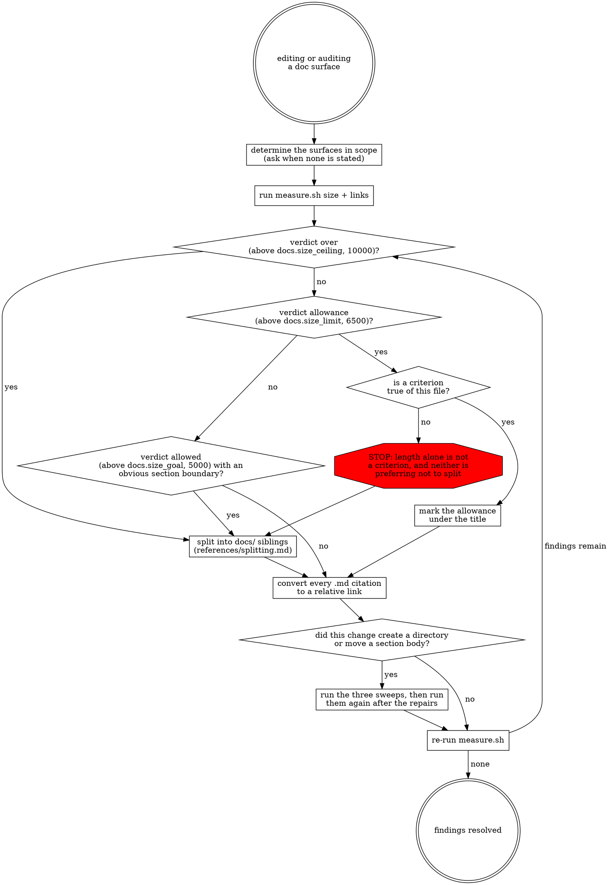

# Structuring Documentation

Treat every Markdown file in scope as a documentation surface. Each one holds one subject, one content class, and a bounded amount of reading.

The surfaces in scope are the paths the user names, or the documentation files the current change touches. The script has no default scope and requires explicit paths. When no scope is stated, ask for it rather than assuming one.

Nothing here gates a build. The measurement reports; you act on what it reports.

Budgets are named values: `docs.size_goal` (default if not otherwise stated: 5000), `docs.size_limit` (6500), `docs.size_ceiling` (10000), `docs.max_index_rows` (20). When earlier context or a user instruction assigns a different value, pass it to the script as `--goal`, `--limit`, `--ceiling`, or `--max-index-rows`; otherwise run the script on its built-in defaults. When earlier context supplies a subject-ownership table for the project, use it wherever the workflow consults ownership.

## Workflow



## Measure

```
bash "${CLAUDE_SKILL_DIR}/scripts/measure.sh" <size|links|all> [flags] PATH...
```

```
bash "${CLAUDE_SKILL_DIR}/scripts/measure.sh" size <Module>/README.md <Module>/AGENTS.md
bash "${CLAUDE_SKILL_DIR}/scripts/measure.sh" links --strict <Module>
bash "${CLAUDE_SKILL_DIR}/scripts/measure.sh" all --goal 4000 <Module> <Module>/docs
```

`${CLAUDE_SKILL_DIR}` is this skill's own directory; on a host that does not define it, substitute the path to this skill's directory.

`size` reports counted characters, raw characters, routing rows, and a verdict per surface. `links` resolves every relative Markdown cross-reference and its anchor from the citing file's own position — web and mail links (http, https, mailto) and non-`.md` targets are skipped by design — and reports every backticked bare `.md` path with whether it resolves.

`--strict` exits 1 on any finding. Use it when you want a failing command; the default reports and exits 0.

Read the actual output. A surface is inside its budget when the tool says so, not when the edit felt small.

## Budgets

Counted on the raw file, in characters.

| Counted characters | Verdict |
|---|---|
| up to `docs.size_goal` (5,000) | at goal |
| `docs.size_goal` to `docs.size_limit` (5,001 to 6,500) | allowed; split when a section boundary is already obvious |
| `docs.size_limit` to `docs.size_ceiling` (6,501 to 10,000) | only against a named allowance criterion, marked in the file and true of it |
| above `docs.size_ceiling` (10,000) | never ships; the surface owns more than one subject |

The budget is a state, not a threshold an edit crosses. A surface the change touches ends the change inside its budget whatever it measured beforehand. Being oversized already is the reason to split now, not an exemption.

Routing rows do not count: a list item or table row whose content is a link to another Markdown file plus at most one sentence. Past one sentence the whole row counts. `AGENTS.md` and `CLAUDE.md` count every character, routing included.

An index carries at most `docs.max_index_rows` (20) routing rows. Past that the surface wants an intermediate grouping, not more rows.

## Allowances

Mark an allowance in an HTML comment directly under the title. Unmarked, the allowance does not exist and the budget is `docs.size_limit` (6,500).

```markdown
<!-- size-allowance: lookup - one entry per supported field type, consulted one at a time -->
```

- `lookup` — one enumeration whose entries share a uniform shape: a list, a table, or repeated same-level headings on one skeleton. Entries are consulted one at a time, never read through.
- `contiguous` — the sections cite each other by name, so splitting would turn in-file references into mutual cross-file ones.
- `atomic` — no internal boundary a reader would jump to: no subheading, and nothing standing in for one. A file that writes its sections as bold lead-ins has headings it declined to mark, and is not atomic.

Length alone satisfies none of the three, and neither does preferring not to split. The criterion is a claim about the file's structure that the next reader can check and reject.

A surface a machine consumer reads whole or parses structurally is exempt outright, and its marker names the consumer: `<!-- size-exempt: parsed by <path> -->`. Before claiming this, find the declaration and say what breaks. A file merely mentioned in a comment is not parsed.

## Cross-references

Every reference to another Markdown file is a relative Markdown link: `[Error codes](docs/error-codes.md)`.

Add an anchor only when the target is a section inside a larger file. An anchor whose slug equals the target file's own title is always wrong: it resolves today, breaks the moment that title is reworded, and buys nothing.

A backticked bare path is not a cross-reference. Convert every one that sends a reader somewhere. A path named as the operand of an instruction stays bare: "edit `services.xml`" names the file to act on, not a place to read.

Outside Markdown, in PHP, YAML, or a shell script, cite the bare path with its anchor and no link syntax. Link syntax renders nowhere there.

A citation with more than one target becomes prose. `<Module>/*/README.md` names every subdirectory's README and no link expresses it.

Never cite a line number.

## Structure per directory

```
<Dir>/
├── README.md   title, orienting paragraph, explanation, index rows into docs/
├── AGENTS.md   symbol index, constraints, Navigation, the README pointer line
├── CLAUDE.md   @AGENTS.md
└── docs/       configuration reference, one subject per file
```

`CLAUDE.md` contains `@AGENTS.md` and nothing else.

`AGENTS.md` never imports `README.md`. An `@` import inlines its target in full, so importing human prose pays for it in every session. `AGENTS.md` points at the README by name instead, with this line verbatim:

```
> Conceptual overview and design rationale for this module live in `README.md`
> (same directory). The references and constraints below are sufficient for most
> code changes; read the README only when you need the mental model.
```

A `docs/` directory is reached by link only. No `@` import targets it. A directory with no reference material carries no `docs/`.

## Which file a fact goes in

Read `references/surface-contract.md` before moving a proposition between files, before adding a section to a `README.md` or an `AGENTS.md`, and before deciding where a new subject lives. It carries the content classes, the single-home rule, and the subject-ownership rule.

## Splitting a surface

Read `references/splitting.md` before moving any `##` section into a new file. It carries the split procedure, the directory and file naming rules, heading promotion, and the four post-split defect classes that no content check finds.
