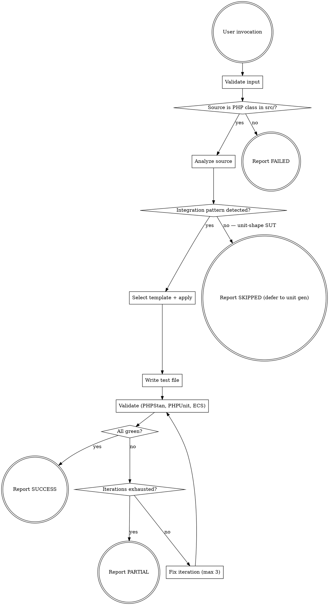

# PHPUnit Integration Test Generation

Generate Shopware-compliant PHPUnit integration tests that exercise wired-up code through `IntegrationTestBehaviour`, produce integration-shape assertions, and pass PHPStan and PHPUnit validation.

## File Write Restrictions

Write ONLY to:
- `tests/integration/**` — Integration test files

NEVER write to:
- `src/**` — Source code (read-only)
- `tests/unit/**` — Out of scope (use `phpunit-unit-test-generation`)
- `tests/migration/**` — Out of scope (use `phpunit-migration-test-generation`)
- Any other directory

## Workflow



## Phase 1: Validate Input

1. Verify single file provided
2. Verify file exists and is a PHP class (not interface/trait/abstract)
3. Verify path starts with `src/`

If validation fails, return FAILED with reason.

## Phase 2: Analyze Source

Read the source class and detect which integration pattern applies. See references/source-analysis.md for the full detection logic.

### Step 1: Extract Metadata

- Class name, full namespace
- `#[Package('...')]` attribute value (default to `'framework'` if absent)
- Constructor dependencies (FQCN list)
- Area from namespace (`Core`, `Administration`, `Storefront`, `Elasticsearch`)
- Public methods and their return types

### Step 2: Detect Pattern

Walk the decision table in references/source-analysis.md. Patterns are evaluated top to bottom; the first match wins.

| Pattern | Indicator |
|---------|-----------|
| `controller` | Extends `AbstractController` or `AbstractRoute` / `Abstract*Route`, or methods carry `#[Route]` |
| `scheduled-task` | Extends `ScheduledTaskHandler`, OR has `#[AsMessageHandler]` and the `__invoke()` parameter is a `ScheduledTask` subclass |
| `message-handler` | Has `#[AsMessageHandler]` on `__invoke()` AND the parameter is a domain message (not a `ScheduledTask`) |
| `indexer` | Extends `EntityIndexer` (Shopware) |
| `dal-flow` | Constructor takes `EntityRepository` AND public methods write through it (`create`, `update`, `upsert`) AND the SUT contract is "the data was persisted" or "the indexer/event was triggered" |
| `multi-service` | Constructor takes ≥ 3 non-boundary dependencies (boundary set defined in `INTEGRATION-002`), and at least 2 are stateful (DAL, indexer, event dispatcher, system config) |

### Step 3: Decide

- **Pattern detected** → Continue to Phase 3
- **No pattern detected** → The SUT is unit-shape. Return SKIPPED with `skip_type: unit_test_more_appropriate` and reason: "Source class fits a unit-shape pattern (no persistence, no wiring, no multi-service coordination under test). Use `phpunit-unit-test-generation` instead." Reference the relevant refactoring pattern in `phpunit-integration-to-unit-migrating/references/refactoring-patterns.md` when the SUT looks like a factory, compiler pass, single subscriber, parser, constraint-only validator, or DAL materializer.

## Phase 3: Generate Test

### Step 1: Determine Test Path

Mirror source path with `src/` → `tests/integration/`:
- `src/Core/Content/Product/ProductIndexer.php` → `tests/integration/Core/Content/Product/ProductIndexerTest.php`
- `src/Core/Checkout/Cart/SalesChannel/CartLoadRoute.php` → `tests/integration/Core/Checkout/Cart/SalesChannel/CartLoadRouteTest.php`

Namespace mirrors the path: `Shopware\Tests\Integration\Core\Content\Product`.

### Step 2: Apply Template

Use the integration test template at templates/integration-test.md. The template has a base block plus one conditional section per pattern. Include exactly one pattern section based on Phase 2 detection. The base block defers all behavior trait `use` statements to the conditional section, because the trait choice varies by pattern:

- **Always (base block)**: namespace, `#[CoversClass]`, `#[Package]`, `@internal`, empty class shell
- **`controller`**: `IntegrationTestBehaviour + SalesChannelApiTestBehaviour` (or admin/storefront equivalent), `IdsCollection`, `KernelBrowser` built via `createCustomSalesChannelBrowser([...])`, `#[Group('store-api')]`, request invocation, response assertions
- **`scheduled-task`**: `DatabaseTransactionBehaviour + KernelTestBehaviour` (lighter than `IntegrationTestBehaviour`), `parent::setUp()`, direct `$handler->run()` invocation, raw SQL `Connection::fetchOne(...)` assertions
- **`message-handler`**: `IntegrationTestBehaviour`, direct `($this->handler)($message)` invocation, DAL read-back assertion (bus dispatch only when transport routing is part of the SUT contract)
- **`indexer`**: `DatabaseTransactionBehaviour + KernelTestBehaviour`, `parent::setUp()`, realtime flow — write via DAL captures `$event`, `$indexer->update($event)` returns `?EntityIndexingMessage`, assert on the returned message's data
- **`dal-flow`**: `IntegrationTestBehaviour`, arrange prerequisite state via DAL, invoke SUT, assert persisted result via separate DAL read
- **`multi-service`**: `IntegrationTestBehaviour` composed with domain behaviours per dependency (`AppSystemTestBehaviour`, `GuzzleTestClientBehaviour`, `MailTemplateTestBehaviour`), configure inputs through `SystemConfigService` / DAL, invoke SUT, assert effects across multiple collaborators

Fill placeholders using Phase 2 metadata. Use `IdsCollection` (`Shopware\Core\Test\Stub\Framework\IdsCollection`) for any test that manages more than one entity ID, and type all repository properties with the generic PHPDoc `@var EntityRepository<XxxCollection>`. Leave `TODO:` markers where the behavior-specific arrange or assertion is genuinely SUT-dependent and not derivable from class structure — these are the spots a human or follow-up step must complete.

### Step 3: Rule Compliance Checklist

The generated test must satisfy all `INTEGRATION-001..008` rules at write time. Self-check before validation:

- INTEGRATION-001: `use IntegrationTestBehaviour;` present
- INTEGRATION-002: SUT and primary collaborators retrieved from container (not mocked); only boundary types may be mocked (HTTP client, mailer, clock, randomness)
- INTEGRATION-003: any DDL, filesystem write, or cache write has a matching teardown (or is wrapped in try/finally)
- INTEGRATION-004: assertions don't depend on wall-clock time or unsourced randomness — assertions on UUIDs go through referential lookups, not literal-value equality
- INTEGRATION-005: no `#[Depends]` between test methods
- INTEGRATION-006: never `markTestSkipped` for missing fixtures — create them
- INTEGRATION-007: arrange + setUp keeps balance with assertion shape; if assertions are unit-shape only, switch to unit test generation (Phase 2 should have caught this)
- INTEGRATION-008: at least one assertion is integration-shape (persistence read-back, event observation, container resolution, HTTP response, real-broker delivery)

### Step 4: Write Test File

Write to the path determined in Step 1.

## Phase 4: Validate and Fix

### Validation Loop

```
- [ ] PHPStan passes (0 errors)
- [ ] PHPUnit passes (all tests green)
- [ ] ECS passes (code style)
```

### Step 1: Run PHPStan

```json
{
  "paths": ["tests/integration/Path/To/GeneratedTest.php"],
  "error_format": "json"
}
```

### Step 2: Fix PHPStan Errors

Common integration test errors:
- Missing imports for `IntegrationTestBehaviour`, `Context`, `Uuid`, `TestDefaults`, `Criteria`
- Type mismatches on `static::getContainer()->get(...)` results — use `assert($x instanceof Foo)` or PHPDoc when the container returns the abstract type
- Unknown method on `EntityRepository` — verify the entity repository service id

### Step 3: Run PHPUnit

```json
{
  "paths": ["tests/integration/Path/To/GeneratedTest.php"],
  "output_format": "result-only"
}
```

If tests fail, re-run without `output_format` to get failure details.

### Step 4: Fix Test Failures

Common integration test failures:
- DDL/filesystem state leaked from a previous run — add cleanup in `tearDown()` (INTEGRATION-003)
- Foreign-key constraint violations during DAL writes — set up required parent entities first
- `markTestSkipped` triggered by missing fixtures — replace with fixture creation (INTEGRATION-006)
- Test references the wrong entity-repository service id

### Step 5: Run ECS Check and Fix

Check for violations, then apply fixes if needed.

### Repeat Until Pass

Loop Steps 1-5 until all validations pass. Maximum 3 iterations — after that, proceed to Phase 5 with status PARTIAL.

## Phase 5: Generate Report

For output format and examples, see references/output-format.md.

### Status Determination

| Condition | Status | skip_type |
|-----------|--------|-----------|
| All validations pass | SUCCESS | — |
| Test generated, validation issues remain after 3 iterations | PARTIAL | — |
| Source class is unit-shape (no integration pattern matched) | SKIPPED | `unit_test_more_appropriate` |
| Invalid input (not a PHP class, file not found, not in src/) | FAILED | — |
