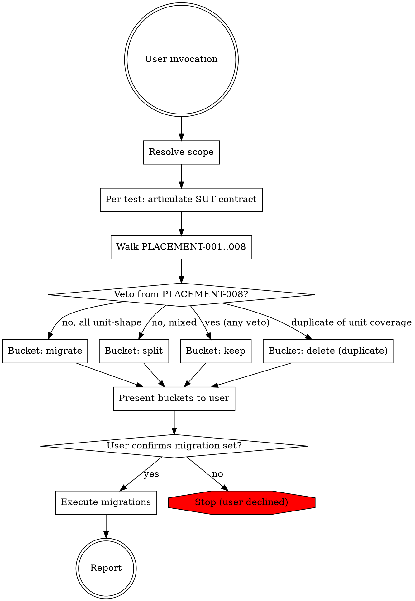

# PHPUnit Integration-to-Unit Migration

Audits integration tests for misplacement and migrates the ones whose apparatus is not load-bearing.

## When to use

- User explicitly asks to audit integration tests for migration candidates
- User points at a file/directory/PR and asks "should these be unit tests?"
- Following the placement smoke-alarm hint from `phpunit-integration-test-reviewing`

This skill is adversarial about placement. It assumes integration tests are misplaced until proven otherwise. Do not invoke for general integration test review — use `phpunit-integration-test-reviewing` for that.

## Workflow



### Phase 1: Scope resolution

1. Accept one of:
   - Single test file path: `tests/integration/Core/.../SomeTest.php`
   - Directory: `tests/integration/Core/Framework/App/Cms/`
   - Branch / PR / commit range: resolve to the list of integration test files touched
2. List the integration test files in scope. If > 20, ask the user to narrow the scope or proceed in batches.
3. Read each file's `#[CoversClass]` and constructor of the SUT class(es) to ground later deliberation.

### Phase 2: SUT contract articulation (REQUIRED gate)

For each test class in scope, before running any rule:

1. **Write down the SUT contract in one sentence**, prefixed with "The SUT...":
   - `OrderIndexerTest` → "The SUT rebuilds order line-item state from persisted product and discount data."
   - `DateFieldSerializerTest` → "The SUT serializes and deserializes date values via the field serializer's encode/decode methods."
2. **Classify the contract**:
   - Unit-shape (pure computation, decision, serialization, validation)
   - Integration-shape (persistence, wiring, dispatch, multi-service interaction)

This step is not optional. Without an articulated contract, the rules below collapse into pattern matching on imports and produce false positives. Record the sentence in the bucket report.

### Phase 3: Load placement rules

1. Call `mcp__plugin_test-writing_test-rules__get_rules(group=placement)` to load PLACEMENT-001..008
2. Also call `mcp__plugin_test-writing_test-rules__get_rules(group=integration, test_type=integration)` to have quality rules available — INTEGRATION-002 mock detection informs PLACEMENT-005's collaborator-graph reasoning, and INTEGRATION-008's assertion-shape catalog is referenced by PLACEMENT-004.

### Phase 4: Apply placement rules

For each test method in each file:

1. Run PLACEMENT-008 (stay-in-integration veto) **first**. If any veto indicator applies (persistence behavior under test, container wiring under test, HTTP layer, multi-service flow as SUT, migration/seed dependency, real broker, compiler-pass-under-kernel), record the veto and bucket the method as **keep**. Skip the remaining rules for that method.
2. Otherwise, walk PLACEMENT-001 through PLACEMENT-007 in order. Record the verdict per rule with a brief justification (one sentence).
3. Combine verdicts:
   - All verdicts say "service locator / materializer / unit-shape / migrate" → bucket: **migrate**
   - Verdicts are split (some methods migrate, some stay; or assertion shape is mixed) → bucket: **split** (move the migratable methods, keep the rest)
   - Duplicate of existing unit coverage (detected via grep for the SUT in `tests/unit/`) → bucket: **delete (duplicate)** — remove without re-creating; cross-reference existing unit test

### Phase 5: Bucket report + user confirmation gate

Present the buckets to the user via the report format in `references/output-format.md`. Then call `AskUserQuestion` to confirm which buckets to execute:

- Confirm the `migrate` set (default: all)
- Confirm the `split` set (default: all)
- Confirm the `delete` set (default: all)
- The `keep` set requires no action

Do NOT execute migrations without explicit user confirmation. If the user declines or wants to narrow, stop and report the audit only.

### Phase 6: Execute migrations

For each test or method in the confirmed set, apply the appropriate refactoring pattern from `references/refactoring-patterns.md`:

1. **Container-fetched factory or service** → construct explicitly with mocked DI collaborators
2. **CompilerPass** → instantiate `ContainerBuilder`, register definitions, call `$pass->process($container)`, assert on definitions
3. **Subscriber** → instantiate, invoke handler directly with constructed event
4. **XML / JSON parser** → move fixtures under `tests/unit/.../_fixtures/Resources/`, drop kernel project dir
5. **Constraint-only rule validation** → instantiate `Validator` via `Validation::createValidatorBuilder()`, build the rule object, assert on `ConstraintViolationList`
6. **DAL materializer** → construct entities in-memory with setters

For each migration:
- Create the new file under `tests/unit/...` mirroring the source class's namespace
- Apply the refactoring pattern
- Carry over data providers, test names, and assertions (assertions usually transfer unchanged)
- Add `#[CoversClass(...)]` matching the unit-shape SUT
- Delete the migrated method (or the entire file, if all methods migrated) from the integration test
- If the integration class becomes empty, delete the file

For `delete (duplicate)` items: simply delete the integration test method/file and cross-reference the existing unit test in the report.

### Phase 7: Report

Produce the final report per `references/output-format.md`: bucket summary, files created, files modified, files deleted, methods moved. Do NOT commit — leave the working tree dirty for the user to review.

## Output Contract

```yaml
scope:
  type: file | directory | pr | branch
  resolved_files: [tests/integration/...]
audit:
  - file: tests/integration/Path/To/SomeTest.php
    sut_contract: "The SUT..."
    contract_shape: unit | integration | mixed
    placement_verdicts:
      PLACEMENT-001: service_locator | sut | n/a
      PLACEMENT-002: materializer | dal_behavior | n/a
      PLACEMENT-003: kernel_under_test | container_only | n/a
      PLACEMENT-004: all_unit | mixed | majority_integration
      PLACEMENT-005: r_count_0 | r_count_1 | r_count_2_plus
      PLACEMENT-006: minimum_smaller | minimum_equal
      PLACEMENT-007: name_body_coherent | name_misleading
      PLACEMENT-008: veto_persistence | veto_wiring | veto_http | veto_multi_service | veto_migration | veto_broker | veto_compiler_pass | no_veto
    bucket: migrate | split | keep | delete
    veto_reason: null  # filled when PLACEMENT-008 vetoes
execution:
  files_created: [tests/unit/...]
  files_modified: [tests/integration/...]  # partial migrations
  files_deleted: [tests/integration/...]   # whole-class migrations or duplicates
  methods_moved: 12
status: AUDITED | MIGRATED | DECLINED | FAILED
```

## Status Values

| Status | Condition |
|--------|-----------|
| AUDITED | Audit complete; user declined to migrate (or no migration candidates found) |
| MIGRATED | User confirmed and migrations executed |
| DECLINED | User declined to proceed after audit |
| FAILED | Invalid scope, source unreachable, or rules not loadable |

## Troubleshooting

### MCP Tool Unavailability

If `mcp__plugin_test-writing_test-rules__get_rules` is unavailable, abort with: "test-rules MCP server not available — ensure the test-writing plugin is installed and Claude Code was restarted." Do not attempt the audit from memory; the rules are the load-bearing reasoning prompts.

### SUT Contract Unclear

If the SUT contract cannot be articulated in one sentence (the test does too many things, the `#[CoversClass]` is missing, the SUT is unclear), bucket the test as **keep** with reason "SUT contract unclear — refactor the test for clarity before considering migration." Do not migrate ambiguous tests.

### Scope Too Large

If > 20 integration test files are in scope, ask the user via `AskUserQuestion` whether to narrow scope or proceed in batches. Batch by directory or `#[CoversClass]` namespace.

### Refactoring Pattern Missing

If a test does not fit any of the patterns in `references/refactoring-patterns.md` but the rules say migrate, bucket as **keep** with reason "Migration would require a novel refactoring pattern not yet codified — consider keeping in integration and capturing the pattern as a follow-up."

### After Migration

The skill does not run PHPUnit/PHPStan/ECS. After execution, the user (or a follow-up invocation of `phpunit-unit-test-writing` / `phpunit-unit-test-reviewing`) validates the migrated tests. Do not claim the migration is correct without that validation step.
