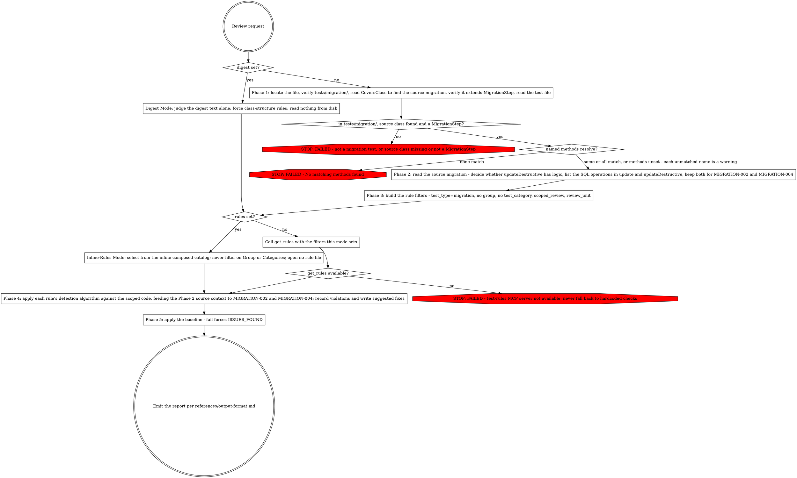

# PHPUnit Migration Test Review

Review a Shopware PHPUnit migration test for compliance with migration testing conventions.

## Overview

Review the test against the composed migration catalog — MIGRATION-001..006, MIGRATION-008 and MIGRATION-009, all must-fix, together with every convention, design, isolation, and provider rule whose `test-types` declares `migration`, at whatever enforce level each carries.

## Input

- `{test_path}` (required unless `{digest}` is set, which supplies the class shape instead) — Path to the migration test file.
- `{methods}` (optional) — List of test method names to scope the review to. When omitted, the full class is reviewed.
- `{review_unit}` (optional) — `method`, `class-structure`, `class-bodies`, or a list of these. When set, only rules whose minimal evaluation unit matches load. When omitted, all rules load. Orthogonal to `{methods}`.
- `{digest}` (optional) — a pre-extracted, body-free structural digest of the test class. When set, review this text and skip reading the test file. Forces `class-structure` rules only. See Digest Mode.
- `{rules}` (optional) — the pre-rendered rule catalog as text, provided in your prompt. When set, enter Inline-Rules Mode: select rules from this text instead of calling `get_rules`. When omitted, rules load via `get_rules`. See Inline-Rules Mode.
- `{baseline}` (optional) — `pass`, `fail`, or `unavailable`: this file's test state before the review, supplied by the caller. Defaults to `unavailable` when omitted. Record and report it; this skill never executes tests to obtain it.

## Workflow



### Phase 1: Identify & Validate

1. Locate test file (by path or `Glob("tests/migration/**/*Test.php")`)
2. Verify file is in `tests/migration/` directory (abort if `tests/unit/` or `tests/integration/`)
3. Read `#[CoversClass(...)]` attribute to find the source migration class
4. Verify source class extends `Shopware\Core\Framework\Migration\MigrationStep`
5. Read the full test file content
6. If `{methods}` provided: verify each named method exists. A method that is not found is a warning, and the remaining methods are still reviewed.

### Phase 2: Source Analysis

1. Read the source migration class identified by `#[CoversClass]`
2. Determine if `updateDestructive()` has logic:
   - Find the `updateDestructive` method body
   - Empty body (`{}`, `{ }`) or only `parent::updateDestructive($connection);` = no logic
   - Any other statements = has logic
3. Identify SQL operations in `update()` and `updateDestructive()`:
   - DDL: `CREATE TABLE`, `ALTER TABLE ... ADD`, `DROP TABLE`, `DROP COLUMN`
   - DML: `INSERT`, `UPDATE`, `DELETE`
   - system_config operations
4. Store this context for rules that need it (MIGRATION-002, MIGRATION-004)

### Phase 3: Rule Review Filters

All `mcp__plugin_test-writing_test-rules__get_rules` calls in Phase 4 carry `test_type=migration` and NO `group` — that composes the catalog for this test type. Adding `group=migration` narrows it back to the migration group alone and drops every shared rule.

When `{methods}` is provided, also add `scoped_review=true`. When `{review_unit}` is set, also add `review_unit={value}`; the filter is single-valued per call, so for a list (e.g. the fused whole-class track `[class-structure, class-bodies]`) issue one call per value and union the results. Never pass a `test_category` filter — A–E categories are a unit-review axis.

### Scoped Review Filtering (Phase 4)

When `{methods}` is provided, apply detection only to the named methods and their associated data providers. The rest of the class is available for context, but violations outside the scoped methods are not reported.

### Digest Mode

When `{digest}` is set, the supplied text is the only artifact under review:

- Do NOT `Read` the test file or the source class. The digest is body-free (class declaration, `#[CoversClass]`, member order, method signatures, attribute lines, property declarations) and self-contained for class-structure rules.
- Force `review_unit=class-structure`. In Phase 4, call `get_rules(test_type=migration, review_unit=class-structure)` with NO `scoped_review`. Apply whatever rules the filter returns — the composed catalog's class-structure rules are CONV-005 and MIGRATION-008. When `{rules}` is also set, instead select the class-structure rules from the inline text per Inline-Rules Mode (`Review unit` == `class-structure`).
- Report `location` as a member name or attribute from the digest (line numbers are unavailable without the file body).
- `{methods}` and `{review_unit}` inputs are subsumed: the digest defines the scope and the unit.

### Inline-Rules Mode

When `{rules}` is set, the catalog is provided as text in your prompt: **select** rules from that text instead of calling `get_rules` in Phase 4. Each rule in the text is a metadata header — `# {id} — {title}`, then `Group: … | Enforce: …`, then `Test types: … | Categories: … | Scope: … | Review unit: … | Scoped review: …` — followed by the rule body. The text is already the composed catalog for this test type, so every rule in it applies here: never filter on `Group`. Select a rule when ALL hold:

- if `{review_unit}` is set: its `Review unit` equals that value (for a list, take the union over the values), **and**
- if `{methods}` is set (scoped review): its `Scoped review` is not `exclude`.

Do not filter on `Categories` — A–E is a unit-review axis. Apply each selected rule's detection algorithm. While `{rules}` is set, the inline text is the complete rule set: **NEVER** read, open, search, or locate a rule file by any means — no `Read`/`Grep`/`Glob`, no `get_rules`. (Reading the test file and its source class is unaffected.) When `{rules}` is omitted, rules load via `get_rules` with the Phase 3 filters.

### Phase 4: Apply Rules

For each rule obtained (inline selection or `get_rules`):

1. Read the rule's Detection / Detection Algorithm section
2. Apply the detection logic against the test code
3. For rules requiring source context (MIGRATION-002, MIGRATION-004), use Phase 2 results
4. Record violations with rule ID, title, enforce level, location, current code, and suggested fix

### Phase 5: Generate Report

Apply the pre-review baseline: when `{baseline}` is `fail`, the report opens with a line before `## Summary` stating that this file's tests were already failing before this review, independent of the rule catalog below, and `status` becomes `ISSUES_FOUND` regardless of what the rule catalog finds. When `{baseline}` is `unavailable`, record it in the Summary's `Baseline` field and change nothing else. When `{baseline}` is `pass`, record it in the Summary's `Baseline` field.

For output format and examples, see references/output-format.md.

Report each issue using the rule's ID and title from `mcp__plugin_test-writing_test-rules__get_rules`:
```
### [{rule_id}] {title}
```

Include for each issue:
- **Current Code** — copied verbatim from the file at the cited location, read at review time. Never reconstructed from memory of the rule or paraphrased.
- **Suggested Fix** — the complete method body after the change. Empty only where the remediation deletes the method entirely; `deleted_methods` then names that method.
- **Issue** — names every line present in Current Code and absent from Suggested Fix. Each such line is a removal, and an unnamed removal is a defect in the finding. (The team-review schema names this field `summary`.)

A suggested remediation never changes what an existing assertion pins, and never introduces an assertion as a means of satisfying a structural, layout, naming, or style constraint — a fix that must compensate that way is wrong by construction: do not emit it. Where the finding IS itself a missing test or a missing assertion (a coverage-gap rule such as MIGRATION-008 or DESIGN-006), those new assertions are that finding's explicit deliverable: name them in the finding, and never smuggle them into a remediation for an unrelated rule. Deletions ride `removed_assertions`. Re-expressing the same pinned fact in a different call — CONV-012's `assertTrue($a === $b)` becoming `assertSame($b, $a)`, or an ISOLATION-004 literal swap — does not change what the assertion pins.

Include full passed checks list.

### Output Contract

```yaml
test_path: tests/migration/Path/To/MigrationTest.php
status: PASS|NEEDS_ATTENTION|ISSUES_FOUND|FAILED
baseline: pass | fail | unavailable   # supplied by the caller; recorded and reported, never executed
errors:
  - rule_id: MIGRATION-001
    title: "Idempotency — update() called at least twice"
    enforce: must-fix
    location: MigrationTest.php:35
    method: testMigration                        # the test method the finding is in; "class-level" for a whole-class or structural finding
    current: |
      # problematic code
    suggested: |
      # fixed code
    implies_src_change: false    # true ONLY when the fix cannot be made in the test alone
    deleted_methods: []          # test methods this fix removes ENTIRELY, by bare name; [] when it removes none
    removed_assertions: []       # [{assertion, covered_by_test}] per removed assertion; covered_by_test names the surviving test, or the literal "none — coverage lost"
warnings:
  - rule_id: CONV-014
    title: "Unclear AAA Structure"
    enforce: should-fix
    location: MigrationTest.php:60
    method: testMigration
    current: |
      # code
    suggested: |
      # reordered code
    implies_src_change: false
    deleted_methods: []          # a CONV-014 fix reorders statements; it never deletes a method
    removed_assertions: []       # nor an assertion — reordering must not change what any assertion pins
informational:
  - rule_id: DESIGN-007
    title: "Data Provider Consolidation"
    enforce: consider
    location: MigrationTest.php:80
    method: class-level
    suggestion: "Optional improvement"
    implies_src_change: false
    deleted_methods: []          # an informational entry whose fix removes test code names it here too
    removed_assertions: []
reason: null                     # the failure text when status is FAILED; null otherwise
```

Every entry names its `method`: the test method the finding is in, or the literal `class-level` for a whole-class or structural finding. `method` is half of a finding's identity (`rule_id|method`), so an omitted or empty value collapses every finding under one rule into the class-level bucket and merges defects that are not the same defect. Never leave it absent, and never write it with a trailing `(...)`.

Set `implies_src_change: true` on a finding whose fix cannot be made in the test file alone — it requires a change under `src/` (for a migration test, the migration class itself). Default it to `false`. It is informational: it never changes `status` and never turns a warning into an error.

## Status Values

| Status | Condition |
|--------|-----------|
| PASS | 0 errors, 0 warnings |
| NEEDS_ATTENTION | 0 errors, 1+ warnings |
| ISSUES_FOUND | 1+ errors |
| FAILED | Invalid input (file not found, not in tests/migration/, source class missing or not a `MigrationStep`), or a refusal from the deletion after-state check |

MIGRATION-001..006, MIGRATION-008 and MIGRATION-009 are all must-fix; the composed catalog's should-fix rules (e.g. CONV-014) populate `warnings`, and its consider-level rules (e.g. CONV-005) populate `informational`. Informational entries never raise `status` — consider-level findings and the guard's `UNRESOLVED` entry alike. A `fail` `{baseline}` sets `ISSUES_FOUND` regardless of this table. A guard refusal sets `FAILED` regardless of this table and of the baseline — `FAILED` outranks every other status.

## Track-Scoped Invocations

The team review decomposes large files into per-track reviews. Each track also receives `{rules}` (the pre-rendered catalog text in its prompt), so rule loading is Inline-Rules Mode selection rather than `get_rules`. Each track sets the inputs below:

- **Method track** — `test_path=…MigrationTest.php`, `methods=[testMigration, testMultipleExecutions]`, `review_unit=method`. Selects the catalog's `method` rules and judges only the named methods.
- **Fused whole-class track** — `test_path=…`, `review_unit=[class-structure, class-bodies]`, plus `methods=[…]` when scoped. Reads full bodies; selects the class-structure and class-bodies rules from the inline text and unions them.
- **Class-structure digest** — `digest="<class shape text>"`, no `test_path` read. Per Digest Mode: select the `class-structure` rules from the inline text and judge them against the digest.

## Troubleshooting

### MCP Tool Unavailability

If `mcp__plugin_test-writing_test-rules__get_rules` is unavailable:
- Report error: "test-rules MCP server not available — ensure the test-writing plugin is installed and Claude Code was restarted"
- Do not fall back to hardcoded checks

### Source Class Not Found

If the `#[CoversClass]` target cannot be located:
- Report FAILED: "Source migration class not found at expected path"
- Include the expected path based on namespace resolution

### Not a Migration Test

If the file is not in `tests/migration/`:
- Report FAILED: "Not a migration test — this skill reviews tests in tests/migration/ only"
- Suggest using `phpunit-unit-test-reviewing` for unit tests
