# PHPUnit Adversarial Test Review

Stress-test reviewer consensus for any test type (unit, integration, or migration): form independent judgment before exposure to findings, then challenge weak consensus, resurrect premature withdrawals, and discover missed violations.

## Input

- `{consensus}` (required) — the consensus package: `consensus_findings`, `withdrawn_findings`, and the reconciliation record per file, provided in full in your prompt.
- `{impressions}` (optional) — impressions pre-formed in an earlier wave. When set, Phase 1 is already done and is skipped.
- `{rules}` (optional) — the pre-rendered rule catalog as text, provided in your prompt. When set, Phase 4 selects rules from it instead of calling `get_rules`.

## Workflow

```dot
digraph adversarial_review {
  "Adversarial review request" [shape=doublecircle];
  "impressions supplied?" [shape=diamond];
  "Phase 1: read each test file and its source class with no rules framework, apply every heuristic lens from references/intuitive-scan-guidance.md, record concerns with a severity estimate" [shape=box];
  "test file and source class readable?" [shape=diamond];
  "STOP: report the failure with the file path and the error; form no impressions, fabricate no files entry" [shape=octagon, style=filled, fillcolor=red];
  "Phase 2: parse the consensus package, validate it carries consensus_findings, withdrawn_findings and a reconciliation record per file" [shape=box];
  "Phase 3: contrast impressions against consensus per references/comparison-strategies.md - intuition-consensus gaps, weak consensus findings, premature withdrawals, unstated premises - into a prioritized candidate list" [shape=box];
  "rules set?" [shape=diamond];
  "Select the candidate's rules from the inline catalog by rule area; open no rule file" [shape=box];
  "Call get_rules for the file's test_type, adding test_category only for unit tests" [shape=box];
  "get_rules available?" [shape=diamond];
  "STOP: report that the test-rules MCP server is unavailable; no candidate can be promoted without evidence, so emit a files entry with endorsements only and no promoted items, noting the limitation to the caller" [shape=octagon, style=filled, fillcolor=red];
  "Phase 4: apply each detection algorithm against the actual code" [shape=box];
  "does a detection algorithm substantiate the candidate?" [shape=diamond];
  "Drop the candidate - intuition proposes, evidence disposes" [shape=box];
  "Promote to a formal challenge, resurrection or new finding; endorse each consensus finding that Phase 1 independently confirmed and a detection algorithm supports" [shape=box];
  "more than one file assigned?" [shape=diamond];
  "Phase 5: compare rule treatment and shared patterns across the assigned files; promote a cross-file inconsistency only through the same evidence gate" [shape=box];
  "Phase 6: group promoted items by file path, add endorsements and cross-file inconsistencies" [shape=box];
  "Emit the challenges report per references/output-format.md" [shape=doublecircle];

  "Adversarial review request" -> "impressions supplied?";
  "impressions supplied?" -> "Phase 2: parse the consensus package, validate it carries consensus_findings, withdrawn_findings and a reconciliation record per file" [label="yes - Phase 1 already done"];
  "impressions supplied?" -> "Phase 1: read each test file and its source class with no rules framework, apply every heuristic lens from references/intuitive-scan-guidance.md, record concerns with a severity estimate" [label="no"];
  "Phase 1: read each test file and its source class with no rules framework, apply every heuristic lens from references/intuitive-scan-guidance.md, record concerns with a severity estimate" -> "test file and source class readable?";
  "test file and source class readable?" -> "STOP: report the failure with the file path and the error; form no impressions, fabricate no files entry" [label="no"];
  "test file and source class readable?" -> "Phase 2: parse the consensus package, validate it carries consensus_findings, withdrawn_findings and a reconciliation record per file" [label="yes"];
  "Phase 2: parse the consensus package, validate it carries consensus_findings, withdrawn_findings and a reconciliation record per file" -> "Phase 3: contrast impressions against consensus per references/comparison-strategies.md - intuition-consensus gaps, weak consensus findings, premature withdrawals, unstated premises - into a prioritized candidate list";
  "Phase 3: contrast impressions against consensus per references/comparison-strategies.md - intuition-consensus gaps, weak consensus findings, premature withdrawals, unstated premises - into a prioritized candidate list" -> "rules set?";
  "rules set?" -> "Select the candidate's rules from the inline catalog by rule area; open no rule file" [label="yes"];
  "rules set?" -> "Call get_rules for the file's test_type, adding test_category only for unit tests" [label="no"];
  "Call get_rules for the file's test_type, adding test_category only for unit tests" -> "get_rules available?";
  "get_rules available?" -> "STOP: report that the test-rules MCP server is unavailable; no candidate can be promoted without evidence, so emit a files entry with endorsements only and no promoted items, noting the limitation to the caller" [label="no"];
  "get_rules available?" -> "Phase 4: apply each detection algorithm against the actual code" [label="yes"];
  "Select the candidate's rules from the inline catalog by rule area; open no rule file" -> "Phase 4: apply each detection algorithm against the actual code";
  "Phase 4: apply each detection algorithm against the actual code" -> "does a detection algorithm substantiate the candidate?";
  "does a detection algorithm substantiate the candidate?" -> "Drop the candidate - intuition proposes, evidence disposes" [label="no"];
  "does a detection algorithm substantiate the candidate?" -> "Promote to a formal challenge, resurrection or new finding; endorse each consensus finding that Phase 1 independently confirmed and a detection algorithm supports" [label="yes"];
  "Drop the candidate - intuition proposes, evidence disposes" -> "more than one file assigned?";
  "Promote to a formal challenge, resurrection or new finding; endorse each consensus finding that Phase 1 independently confirmed and a detection algorithm supports" -> "more than one file assigned?";
  "more than one file assigned?" -> "Phase 5: compare rule treatment and shared patterns across the assigned files; promote a cross-file inconsistency only through the same evidence gate" [label="yes"];
  "more than one file assigned?" -> "Phase 6: group promoted items by file path, add endorsements and cross-file inconsistencies" [label="no"];
  "Phase 5: compare rule treatment and shared patterns across the assigned files; promote a cross-file inconsistency only through the same evidence gate" -> "Phase 6: group promoted items by file path, add endorsements and cross-file inconsistencies";
  "Phase 6: group promoted items by file path, add endorsements and cross-file inconsistencies" -> "Emit the challenges report per references/output-format.md";
}
```



### Phase 1: Independent Intuitive Scan

Read each assigned test file and its source class (from `#[CoversClass]`). Do NOT use MCP rule tools (`get_rules`) in this phase.

Load references/intuitive-scan-guidance.md for heuristic lenses, then for each file:

1. Read the test file completely
2. Read the source class under test (from `#[CoversClass]`)
3. Apply each heuristic lens from the guidance
4. Record concerns as free-form observations with severity estimate

Output per file:

```yaml
impressions:
  - file_path: tests/unit/Path/To/ClassTest.php
    concerns:
      - area: "brief description of concern"
        severity: high | medium | low
```

### Phase 2: Receive Consensus Package

Validate the package carries `consensus_findings`, `withdrawn_findings`, and `reconciliation_record` per file. This is the first exposure to reviewer reasoning — note your initial reactions before proceeding.

### Phase 3: Structured Comparison

Load references/comparison-strategies.md. Per file, contrast impressions against consensus:

1. **Intuition-consensus gaps** — Phase 1 concerns that no reviewer raised. These are the highest-value candidates for new findings. For each unmatched concern, note which area of the code it targets.

2. **Weak consensus findings** — for each consensus finding, apply the "would this survive harder pushback?" test:
   - MAJORITY findings with thin reasoning in the reconciliation record
   - Findings where the reconciliation record shows quick concession without evidence
   - Findings that don't match your Phase 1 impressions at all

3. **Premature withdrawals** — for each withdrawn finding, check:
   - Does the concession reason cite a specific detection algorithm? If not, flag it.
   - Did your Phase 1 scan independently flag the same area? If yes, strong resurrection candidate.
   - Did only one reviewer push back while others followed? Bandwagon pattern.

4. **Assumption excavation** — for each consensus finding, state the unstated premise:
   - What must be true for this finding to be valid?
   - What breaks if that premise is wrong?

Output: prioritized list of candidate challenges, resurrections, and new findings — not yet evidence-backed.

### Phase 4: Evidence Gathering

Per candidate, highest priority first:

1. Load applicable rules and detection algorithms: when `{rules}` is set, the inline text is the full rule catalog for this file's test type — select the rules relevant to the candidate finding and your lens axis. For unit tests, select those whose `Categories` include the detected A–E category; integration and migration rules carry `Categories: all`, so select by rule area, not category. The text holds every rule, so **NEVER** read, open, search, or locate a rule file by any means (no `Read`/`Grep`/`Glob`, no `get_rules`); reading the test/source code is unaffected. Otherwise call `mcp__plugin_test-writing_test-rules__get_rules(test_type={the file's test type})`, adding `test_category={category}` only for unit tests.
2. Apply the detection algorithm against the actual code

**Promotion gate**: promote a candidate to a formal challenge ONLY if a detection algorithm substantiates it. Drop candidates where the evidence doesn't hold up. This is the filter against contrarianism — intuition proposes, evidence disposes.

**Endorsement**: consensus findings that Phase 1 intuition independently confirmed AND that have strong detection algorithm support get endorsed. Endorsements are part of the output — they strengthen findings in the final report.

### Phase 5: Cross-File Inconsistency Scan

Compare patterns across all assigned files:

1. For each rule_id that appears in any file's consensus, check if the same pattern exists in other files:
   - File A's consensus accepted a pattern that file B's consensus flagged -> high-value challenge
   - All files share the same weakness but none flagged it -> systemic finding

2. Compare treatment of similar code patterns:
   - setUp() strategies across files
   - Mocking approaches (createMock vs createStub)
   - Assertion styles
   - Data provider usage

Cross-file inconsistencies use the same promotion gate as Phase 4 — cite the detection algorithm.

### Phase 6: Generate Challenges Report

Load references/output-format.md. Assemble the structured output: promoted challenges grouped by file path, every endorsement, and the Phase 5 cross-file inconsistencies.

The report carries no top-level status or failure-reason field — `NO_CHALLENGES` is simply a `files` entry with no `challenges_to_consensus`, `resurrections`, or `cross_file_inconsistencies` (endorsements only, or none). Failure to form impressions in Phase 1 is handled per Troubleshooting below, not by a status field here.

## Output Contract

```yaml
adversary: reviewer-2
files:
  - path: tests/unit/Path/To/ClassTest.php
    challenges_to_consensus:
      - finding_id: "CONV-004|testFoo"
        rule_id: CONV-004
        consensus_was: UNANIMOUS | MAJORITY
        challenge: "Detection algorithm requires X but..."
        verdict_sought: overturn | weaken
    resurrections:
      - finding_id: "DESIGN-005|testBar"
        rule_id: DESIGN-005
        withdrawn_reason: "Conceded without evidence"
        resurrection_argument: "The concession was premature because..."
        code_evidence: "ClassTest.php:72 — ..."
    new_findings:
      - rule_id: ISOLATION-002
        enforce: must-fix
        location: ClassTest.php:88
        method: testBaz
        summary: "Description"
        current: |
          # code
        suggested: |
          # fix
        implies_src_change: false    # true ONLY when the fix cannot be made in the test alone
        deleted_methods: []          # bare names of test methods this fix deletes outright
        removed_assertions: []       # [{assertion, covered_by_test}] per assertion this fix drops
    endorsements:
      - rule_id: UNIT-003
        reason: "Strong finding, correctly applied"
    cross_file_inconsistencies:
      - rule_id: CONV-004
        this_file_status: accepted
        other_file: tests/unit/Other/ClassTest.php
        other_file_status: flagged
        inconsistency: "Same pattern, divergent treatment"
```

`finding_id` on a challenge or resurrection is quoted verbatim from the consensus/withdrawn finding under scrutiny — never invented or altered. `new_findings` carries no `detection_algorithm_citation` field; cite the detection algorithm in `summary` instead.

Every `new_findings` entry carries `implies_src_change`, `deleted_methods` and `removed_assertions` — always, including when nothing applies (`false`, `[]`, `[]`). Set `implies_src_change: true` when the fix cannot be made in the test alone and requires a change under `src/`. Emit these fields whether or not a consensus package instructed you to: omitting them under-counts the source-change escalation and hides deletions from the after-state guard.

## Troubleshooting

### No Impressions Formed in Phase 1

If the test file or source class cannot be read:
- Stop and report the failure with the file path and error — do not proceed to comparison phases without impressions, and do not fabricate a `files` entry to fit the schema

### MCP Tool Unavailability

If `mcp__plugin_test-writing_test-rules__get_rules` is unavailable:
- Report error: "test-rules MCP server not available — ensure the test-writing plugin is installed and Claude Code was restarted"
- Candidates from Phase 3 cannot be promoted without evidence — emit a `files` entry with no challenges, resurrections, or new_findings (endorsements only, if any), noting the limitation in the report handed back to the caller

### All Candidates Fail Promotion Gate

If Phase 4 drops all candidates (none substantiated by detection algorithms):
- This is a valid outcome — emit a `files` entry with no challenges, resurrections, or new_findings
- Include endorsements for strong consensus findings
- The adversary adds value by confirming the consensus is robust
