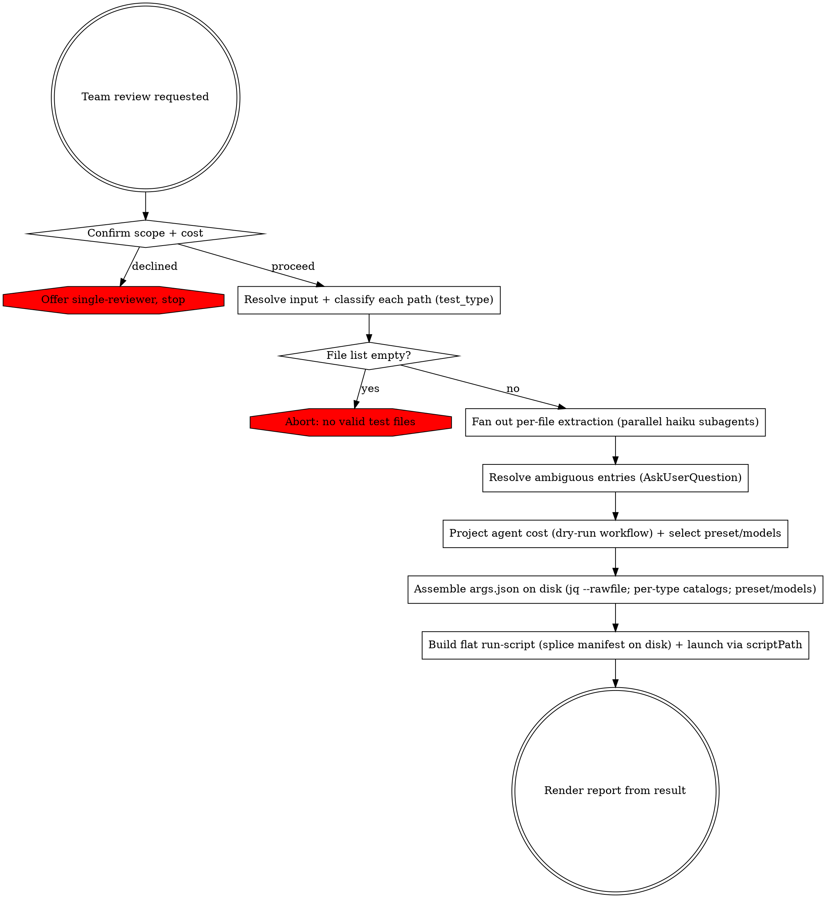

# Team-Based PHPUnit Test Review

Resolve the input into a mixed test-file manifest, classify each file by test type, build each file's manifest entry in parallel, assemble the run input on disk, splice it into a flat top-level copy of the committed review workflow, launch that copy, and render its result. The review runs as a multi-agent workflow: fresh agents that each invoke the project's review sub-skills, coordinated across waves with no agent-to-agent messaging. It is strictly read-only — it never mutates the tests under review.



## Phase 0: Confirm Scope & Cost

This review spawns many parallel agents and consumes substantially more tokens than a single-reviewer pass. Ask via `AskUserQuestion` whether to proceed with the team review or run a single-reviewer pass with the matching per-type reviewing skill (`phpunit-unit-test-reviewing` for unit, `phpunit-integration-test-reviewing` for integration, `phpunit-migration-test-reviewing` for migration) instead. Proceed only on confirmation. The preset and model combo are chosen later (Phase 2), informed by the projected agent count.

## Phase 1: Resolve Input to a Manifest

`Read` references/input-resolution.md. Resolve the input to a **file list** and classify each path by its root — `tests/unit/` → `test_type=unit`, `tests/integration/` → `integration`, `tests/migration/` → `migration`. Resolve interactive ambiguity that blocks resolution — base branch for a branch diff, unclear scope — with `AskUserQuestion`; the review cannot ask once it is running. If the file list is empty, abort per references/error-handling.md.

Then build each file's entry **in parallel**: spawn one `general-purpose` subagent per file, pinned to `model: haiku`, each running references/input-resolution.md §Per-File Extraction. Inline that contract verbatim into every spawn — a spawned agent never reads the reference. Each subagent measures its file with `wc`/`grep` (never estimates), enumerates every test method, resolves the `#[CoversClass]` source, computes the cross-file `fingerprint` and (when the file's combined lines exceed the digest threshold) the body-free `digest` — or, when the source cannot be resolved to a `src/` file, returns `ambiguous: true` with a reason instead of guessing.

Aggregate the returned entries. For every entry flagged `ambiguous`, resolve it with `AskUserQuestion` and refill its fields from the answer — a guessed source size silently flips the track decision, so nothing ambiguous may reach the run. Let N = number of files.

Output: a manifest of validated entries, each with `test_type`, method scope (`methods`, plus the diff-touched `changed_methods` on diff runs), the full `test_methods` list, resolved `source_path`/`source_paths`, decomposition measurements (`test_lines`, `source_lines`, `method_count`), `fingerprint`, and a `digest` when combined lines exceed the threshold (references/input-resolution.md).

## Phase 2: Project the Agent Cost & Select the Preset

Run the workflow in projection-only mode to show the per-preset agent count, then let the user choose the preset and model combo informed by it. This step spawns **no** review agents.

1. `Write` a dry-run input — `{ "files": [<the Phase-1 entries>], "dry_run": true }` — to `dry-args.json`. A dry run needs no rule catalogs.
2. Build and launch it the same way Phase 4 launches the real run, but against `dry-args.json`: run `${CLAUDE_SKILL_DIR}/workflow/build-run-script.sh dry-args.json "$DRY_OUT"` (with `DRY_OUT` a `mktemp` path outside the repo), then the `Workflow` tool with `scriptPath: "$DRY_OUT"` and no `args`. It returns immediately with the projection result (`{ dry_run: true, files, slots, model_combos, projections }` — references/report-format.md §Dry-Run Projection).
3. Render `projections` as a compact table (per preset: `units`, `wave0_agents`, `max_structural_agents`, `chunks`), noting `max_structural_agents` is an upper bound — conditional waves and arbitration run fewer.
4. Present preset + model combo as an `AskUserQuestion`, defaulting to `standard` / `sonnet-opus`. Carry the chosen names to Phase 3.
   - **preset** — `deep` / `standard` / `lean`: cost/quality operating point (whole-class coverage threshold, shard granularity, adversary lens count, arbitration cap). Per-preset values: references/reviewer-allocation.md.
   - **models** — `sonnet-opus` / `haiku-opus` / `haiku-sonnet`: body and adversary model tiers. Lower body tiers cut cost but reduce rule-application precision; keep the adversary tier no lower than sonnet.

## Phase 3: Assemble the Run Input on Disk

The committed workflow runs sandboxed — no filesystem, no MCP — and reads its manifest from one inlined value. Assemble that value as a JSON file on disk; the catalogs are large (tens of KB each, ~160 KB total) by design, so splice them in **by path** and never load them into context.

1. **Per-type rule catalogs.** For each test type present in the manifest, call `build_rule_package` and keep the returned **path** (do not `Read` it):
   - unit → `build_rule_package()` (no arguments)
   - integration → `build_rule_package(group=integration, test_type=integration)`
   - migration → `build_rule_package(group=migration, test_type=migration)`

   When any integration file is present, also call `build_rule_package(group=placement, test_type=integration)` for the placement-flag signal. If a needed build fails or reports zero rules, abort (references/error-handling.md).
2. **Assemble `args.json`.** `Write` the Phase-1 entries (plus any `base` ref and the Phase-2 `preset` / `models` names) to `manifest-core.json`, then merge the catalogs in by path with `jq --rawfile` so their bytes never enter context — include only the `rule_packages` keys for types actually present:

   ```
   jq -n \
     --slurpfile core manifest-core.json \
     --rawfile unit  <unit catalog path> \
     --rawfile integ <integration catalog path> \
     '{ files: $core[0].files, base: $core[0].base,
        preset: $core[0].preset, models: $core[0].models,
        rule_packages: { unit: $unit, integration: $integ } }' \
     > args.json
   ```

   `preset` / `models` are optional in the manifest; the workflow fail-soft defaults them to `standard` / `sonnet-opus` when absent or unknown.

The manifest is fixed here, before the run — nothing ambiguous may reach it.

## Phase 4: Build the Flat Run-Script and Launch

Splice `args.json` into a top-level copy of the committed workflow, then launch that copy. The manifest cannot be passed as `args` — the value has no file channel and the payload is too large to emit inline — and nesting the committed workflow as a child collapses its wave display; so the run-script defines the manifest directly and runs the committed orchestration at top level.

1. Choose a destination path **outside the repository** — e.g. `OUT="$(mktemp -d)/run-team-review.mjs"`. Never write the run-script into the skill or plugin directory.
2. Run `${CLAUDE_SKILL_DIR}/workflow/build-run-script.sh args.json "$OUT"`. It validates `args.json` with `jq empty`, asserts the committed workflow still carries its single manifest-read line (failing loudly otherwise), and writes the spliced run-script to `$OUT`.
3. Launch with the `Workflow` tool, passing `scriptPath: "$OUT"` and **no `args`**. It runs in the background and returns a single result matching references/report-format.md.

The committed `workflow/team-review.workflow.mjs` is the sole orchestration — do not compose, write, or search for an alternative, and treat any leftover run-script from a prior run as stale. Launch directly: do not consult the advisor before launching. Consult the advisor only after a launched run fails for a reason you cannot identify.

## Phase 5: Render the Report

`Read` references/report-format.md and render the result into the report.

## Error Handling

For input-resolution failures, review start-up or run failures, partial-wave outcomes, and consensus edge cases, `Read` references/error-handling.md.
