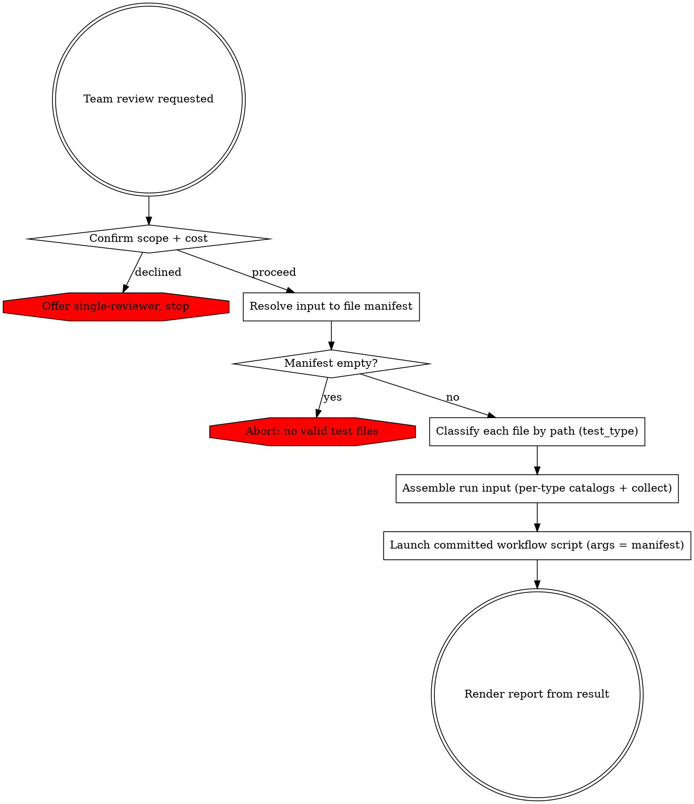

# Team-Based PHPUnit Test Review

Resolve the input into a mixed test-file manifest, classify each file by test type, build the run input from it, launch the committed review workflow script, and render its result. The review runs as a multi-agent workflow: fresh agents that each invoke the project's review sub-skills, coordinated across waves with no agent-to-agent messaging. It is strictly read-only — it never mutates the tests under review.

## Phase 0: Confirm Scope & Cost

This review spawns many parallel agents and consumes substantially more tokens than a single-reviewer pass. Ask via `AskUserQuestion` whether to proceed with the team review or run the standard single-reviewer (`phpunit-unit-test-writing`) instead. Proceed only on confirmation.

## Phase 1: Resolve Input to a Manifest

`Read` references/input-resolution.md, then follow its strategies to build the file manifest. Classify each file by its path root — `tests/unit/` → `test_type=unit`, `tests/integration/` → `integration`, `tests/migration/` → `migration` — and resolve each file's `source_paths` per type. Resolve all interactive ambiguity here — base branch, unclear scope — using `AskUserQuestion`. The review cannot ask the user once it is running, so nothing ambiguous may reach it.

Output: a manifest of validated test files, each with `test_type`, a method scope (changed methods, or full class), the full test-method name list, resolved `source_path`/`source_paths`, and decomposition measurements (test/source line counts, method count — see references/input-resolution.md). Let N = number of files. If the manifest is empty, abort per references/error-handling.md.

## Phase 2: Assemble the Run Input

The script runs sandboxed and reads only its `args`. Assemble that input:

1. **Per-type rule catalogs.** For each test type present in the manifest, call `build_rule_package` and `Read` the returned path:
   - unit → `build_rule_package()` (no arguments) → `rule_packages.unit`
   - integration → `build_rule_package(group=integration, test_type=integration)` → `rule_packages.integration`
   - migration → `build_rule_package(group=migration, test_type=migration)` → `rule_packages.migration`

   When any integration file is present, also call `build_rule_package(group=placement, test_type=integration)` → `rule_packages.placement` (for the placement-flag signal). If a needed build fails or reports zero rules, abort (references/error-handling.md). Each catalog is large (tens of KB) by design — expected, not a problem to solve. You pass each inline as text under `args.rule_packages.{type}` in Phase 3: reproduce the `Read` content directly into `args`. `args` carries the value inline — it has no file or path channel, and none is needed; its size is not a launch blocker and not a question to take to the advisor. Do not open `workflow/team-review.workflow.mjs` to confirm this contract — Phases 2–3 here are authoritative; the script is launched, not read.
2. **Pre-Run Collect.** Perform references/workflow-design.md §Pre-Run Collect with your own `Read`/`Grep`: compute each file's cross-file `fingerprint`; for each file whose combined lines exceed `C`, extract the body-free structural `digest`.
3. **Manifest object.** Build `{ files: [ <Phase-1 entries> + fingerprint + (digest when L > C) ], rule_packages: { <type>: <rendered catalog> per present type, placement?: <rendered placement catalog> }, base: <base ref if any> }`.

The manifest is fixed here, before the run — nothing ambiguous may reach it.

## Phase 3: Launch the Review

Launch the committed script with the `Workflow` tool, passing `scriptPath: ${CLAUDE_SKILL_DIR}/workflow/team-review.workflow.mjs` and the Phase-2 manifest as `args`. It runs in the background and returns a single result matching the result shape in references/report-format.md.

Launch directly, overriding your standing defaults for this step: do not consult the advisor before launching, and do not pause on the manifest's size. `workflow/team-review.workflow.mjs` is the only orchestration — do not compose, write, or search for an alternative, and treat any leftover script from a prior run as stale. Consult the advisor only after a launched run fails for a reason you cannot identify.

## Phase 4: Render the Report

`Read` references/report-format.md and render the result into the report.

## Error Handling

For input-resolution failures, review start-up or run failures, partial-wave outcomes, and consensus edge cases, `Read` references/error-handling.md.
