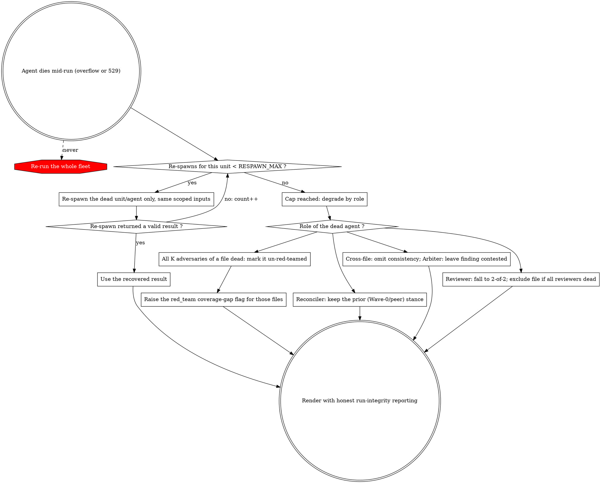

# Error Handling

## Input Resolution Failures

These abort **before** the run starts — the fail-hard guard, distinct from the mid-run recovery below.

| Scenario | Action |
|---|---|
| 0 files resolved | Abort before the review starts. Report strategies tried and why each produced no results. |
| A file outside `tests/{unit,integration,migration}/` | Cannot be classified — exclude it with a reported reason; continue with the rest. |
| Some files missing `#[CoversClass]` | Exclude those files, continue with the rest. Report excluded files. |
| A surviving file's `#[CoversClass]` source cannot be resolved | Abort before the review starts — the source line count is required for the track decision; never guess it. Report the unresolved file. |
| All files excluded after validation | Abort before the review starts. Report validation failures per file. |
| A `test_type` is present but its rule catalog is missing/empty | A `review` or `adversarial` run fails hard at launch (`rule_packages.{type}` is required for every test type present in the manifest). Build the missing per-type catalog in Phase 3 (`build_rule_package` with the matching group/test_type) and re-run. A `signals` run needs no catalogs. |
| `mode=adversarial` without `consensus` payloads | Fails hard at launch — every manifest file needs its persisted `adversarial_input` from the shard results. Re-extract the payloads (skill Phase 6) and relaunch. |
| A run's projection exceeds `AGENT_BUDGET` | Fails hard **before any agent spawns** — the run cannot finish (cached replays count toward the engine's 1000-agent lifetime cap, so resuming cannot rescue it). Shard the manifest (skill Phase 2) and relaunch. |

## Mid-Run Agent Death — Recovery

A single agent dying mid-run (a "Prompt is too long" overflow or a transient `529 Overloaded`) is **not** a run failure and **never** triggers a whole-fleet re-run. Re-spawn the dead unit/agent up to `RESPAWN_MAX`; only when that is exhausted does the role's graceful degradation apply, and any lost adversary coverage is flagged — never hidden.

### Re-spawn (first recourse)

When an agent dies, re-spawn **only that unit/agent** — never the rest of the fleet. Cap at `RESPAWN_MAX` (= 1) attempt per agent. Use a valid re-spawn result as the original.

**Size-aware re-spawn (adversaries).** `agent()` returns `null` on a terminal death without exposing the error class, so the script cannot branch on "prompt is too long" specifically. A red-team adversary's single re-spawn therefore carries a **degraded payload** — the compact rule index (rule ID + title, no bodies) and an instruction to read only the cited finding locations. It recovers a transient stall (the degraded prompt is a strict subset) and catches a deterministic overflow, which re-sending the identical prompt cannot — a residual overflow becomes a *degraded-but-present* adversary rather than a lost one. Reviewers/reconcilers keep their scoped inputs unchanged on the retry (per-unit scope already bounds their size).

**Storm suppression.** After `STORM_NULLS` consecutive terminal deaths across the run, retries are skipped entirely — during a usage-limit storm every retry is a guaranteed dead agent that still burns a slot toward the engine's 1000-agent lifetime cap (measured: 852 dead retries in one storm). The wave-level circuit breaker (below) then halts the run.

### Wave-level circuit breaker → partial result

When a wave of ≥ `WAVE_NULL_MIN` agents loses ≥ `WAVE_NULL_RATE` of them to terminal deaths, the run **halts at the wave boundary** and returns a structured partial result — `{ partial: true, halted_at: {wave, dead_agents, wave_size}, files: <completed>, unprocessed_files: [...] }` — instead of continuing. Continuing through a storm would build consensus from degraded peer sets and journal every downstream result keyed to those degraded prompts, which poisons the run's journal: a later resume re-keys the whole tail and re-runs it. Per-file results completed before the halt are real and keep their value; nothing from the halted wave is consumed.

### Degrade by role (after re-spawn is exhausted)

Only after a unit burns `RESPAWN_MAX` does its role's graceful degradation apply: every loss is either covered (reviewer 2-of-2) or **loudly flagged** (adversary coverage gap). One row below is not a death: a defense stance that returns but fails an integrity guard loses the same voice a dead defender would, so it takes the same path — no re-spawn precedes it, because the agent did answer.

| Dead role (after re-spawn) | Action |
|---|---|
| Some reviewers of a file | Fewer than 3 stances remain → use the Consensus Edge Cases below (2-of-2, reduced confidence). |
| All reviewers of a file | Exclude that file; report it as unreviewed. |
| One lens adversary of a file | No action — the file is still covered by its other lens adversaries (a file needs ≥ 1 of its K adversaries to survive). |
| **All K** lens adversaries of a file | Mark that file **un-red-teamed** and raise the `red_team` coverage-gap flag for it — never substitute peer stances as if adversarial coverage were complete. |
| A defense reconciler | Keep that reviewer's peer stance; the adversary challenges have no effect on it. |
| A defense reconciler's stance that fails an integrity guard (an entry with no `finding_id`, or one quoting a `finding_id` that resolves to no known record) | Same path as a dead one, never a run failure — a throw at the wave boundary would discard every agent the run already completed. Drop the offending **entry** only; the rest of that stance still votes. The finding the entry named keeps the consensus binding the review stage gave it. Record each drop in `red_team.defense_degraded` (`null` when clean, else `{dropped: [...], note}` — the same shape as `coverage_gap`), naming the file, the defender, the `finding_id`, what the entry was, and the guard that refused it. A dropped promotion is credited in no metric: it moved nothing. |
| The cross-file agent | Omit the consistency section; note it in the report. |
| A single arbiter (should-fix / consider) | Leave the finding contested; do not include it in the body. |
| All 3 arbiters of a contested must-fix | Leave the finding contested (still shown in the contested section). A *partial* vote with no majority keeps it in the body marked `split` — never silently dropped. |

### Adversary-coverage gate

Track which in-scope files were actually red-teamed. A file is covered if **≥ 1** of its K lens adversaries returned. After all re-spawns settle, if **all K** of a file's adversaries failed, the result's `red_team` must carry a prominent **coverage-gap flag** naming that file — never paper over it with peer stances.

## Run Failures & Campaign Stop/Resume

| Scenario | Action |
|---|---|
| Workflow tool unavailable / cannot start | Inform the user the multi-agent review could not start; offer the single-reviewer skill (`phpunit-unit-test-writing`). |
| Run aborts on the fail-hard guard (empty manifest, missing field, over-budget projection) | This is the intended guard. Fix the manifest / shard the campaign and run again; never re-run on empty input. |
| A single agent errors mid-flight | Not a run failure — see Mid-Run Agent Death (re-spawn that unit, never the whole fleet). |
| A stage result carries `partial: true` (circuit breaker) | **Stop the campaign** — do not launch the next stage into a known-dead quota window. Report which stages completed (their persisted results stand) and which did not. |
| Resuming a **circuit-breaker-halted** stage | The run halted cleanly at a wave boundary, so its journal is clean up to the halt — `resumeFromRunId` replays the completed waves and re-runs the tail. Acceptable once quota is back. |
| Resuming a **storm-killed or crashed** stage | Relaunch the stage **clean** (same args file, fresh run). A storm-poisoned journal replays poorly — later-wave prompts embed earlier results, so re-run gaps re-key the whole tail and the "resume" re-executes most of it anyway, while replays burn the agent cap. A clean shard relaunch costs ≤ S_max agents by construction. |
| Resuming the **campaign** (new session, next quota window) | Everything needed is on disk in the campaign directory: `campaign.json`, per-stage args files, run-scripts, and completed stage results. Launch only the stages without a persisted result; never re-run a stage whose result file exists. |

## Consensus Edge Cases

| Scenario | Action |
|---|---|
| File has only 2 valid stances | 2-of-2 voting: both agree → include; disagree → contested. Note reduced confidence. |
| File has only 1 valid stance | Include all findings with the annotation "Single reviewer — no consensus possible." |
