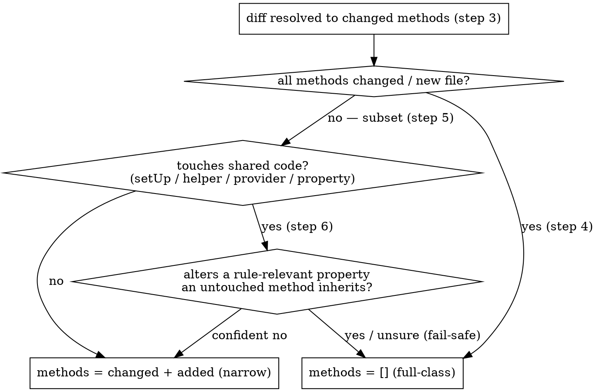

# Input Resolution

Resolve user input into a validated, classified file manifest. Try resolution strategies in order until one matches. The run is **mixed**: a PR touching unit, integration, and migration tests produces one manifest with each file tagged by `test_type`.

## Resolution Strategies

| Input pattern | Resolution | Tool | Method scope |
|---|---|---|---|
| Explicit file path(s) | Verify existence, check `*Test.php` under `tests/unit/`, `tests/integration/`, or `tests/migration/` | `Read` | No scope — full-class review |
| Glob pattern | Expand, filter to `*Test.php` under the three test roots | `Glob` | No scope — full-class review |
| Commit SHA / `HEAD~N` | Get changed files, filter to test files | `Bash(git diff-tree --no-commit-id --name-only -r <ref>)` | Parse changed method names from diff hunks |
| Branch / "current branch" | **MUST** ask user for base branch before diffing — do not assume or infer it | `AskUserQuestion("What is the base branch?")` → `Bash(git diff --name-only <base>...<branch>)` | Parse changed method names from diff hunks |
| PR reference | Get PR file list, filter to test files | PR files tool | Parse changed method names from PR diff |
| Directory path | Find all test files recursively | `Glob("{dir}/**/*Test.php")` | No scope — full-class review |
| Natural language | Interpret intent, search for matching tests | `Glob` + `Grep` | No scope — full-class review |

For branch-based resolution: always ask — never guess, even if the base branch seems obvious from git context. Use the user's answer with `Bash(git merge-base HEAD <base-branch>)` to determine the diff range.

## Classification (`test_type`, the primary axis)

Tag each resolved file from its path root — reliable, and the per-type reviewers already enforce their directory:

- `tests/unit/…` → `test_type=unit`
- `tests/integration/…` → `test_type=integration`
- `tests/migration/…` → `test_type=migration`

A file outside the three roots is excluded with a reported reason (continue with the rest). If 0 files survive, abort with the FAILED report below.

## Per-File Extraction (Subagent Contract)

The orchestrator resolves the file list (Resolution Strategies) and classifies each path (Classification) inline. It then builds the per-file entries in parallel: one `general-purpose` subagent per file, pinned to `model: haiku`, with this contract inlined verbatim into each spawn — the spawned agent has only what the prompt carries, so the orchestrator never passes a file reference in its place.

**Input per subagent:** `{ path, test_type, base_ref? }`.

**Procedure (this one file only):** run Diff-to-Method Resolution, Post-Resolution Validation & Per-Type Source Resolution, and Decomposition Measurement (below); then compute the cross-file `fingerprint` and, when `test_lines + source_lines > 800` (the fixed digest floor — the lowest preset `C`; see workflow-design.md §Pre-Run Collect), the body-free `digest` (both defined in workflow-design.md §Pre-Run Collect). Compute the digest at this fixed floor regardless of the run's selected preset, so any preset's `L > C` digest-track files have a digest. Return the Output entry.

**Hard rules:**
- Counts come from `wc -l` / exhaustive `grep`, never estimation. Enumerate **every** `public function test*` into `test_methods` — this list drives the shard count.
- **Emit every path repo-relative.** `path`, `source_path`, and every `source_paths` entry should be relative to the repository root — forward slashes, no leading `./`, no absolute prefix. Compute the relative form explicitly, e.g. `realpath --relative-to="$(git rev-parse --show-toplevel)" <path>`. Downstream string-keyed joins (the cross-cutting coverage map, the adoption signal) key on these strings, so one SUT spelled absolute in one entry and relative in another would split into two identities and drop the coverage overlap. The workflow canonicalizes any path under `src/`/`tests/` to repo-relative as a safety net and aborts pre-launch only on a path it cannot resolve under those roots — but emit repo-relative directly so the manifest and report read cleanly.
- Apply the narrow/keep change-impact gate (Diff-to-Method Resolution step 6) when a diff touches `setUp`/`tearDown`, a private helper, a data provider, or a class property: keep `methods: []` (full-class) by default; narrow to changed + added ONLY when the change is backward-compatible with no rule-relevant shape change; uncertain ⇒ keep (fail-safe).
- **Fail hard, do not guess.** For unit and migration tests, if `#[CoversClass]` is missing or its source cannot be resolved to a `src/` file, set `ambiguous: true` with `ambiguous_reason` and return — never fabricate `source_paths`/`source_lines`. An integration test carries no `#[CoversClass]` by convention; resolve its `source_paths` by directory mirroring (Post-Resolution Validation & Per-Type Source Resolution, step 4) instead, and set `ambiguous: true` with `ambiguous_reason` only when that mirroring finds no existing directory under `src/` to walk up to. A guessed `source_lines` silently flips the `T`/`C` track decision. The orchestrator resolves every `ambiguous` entry with `AskUserQuestion`, so nothing ambiguous reaches the run.
- Read-only: no edits, no PHP tooling, no rule-package or MCP calls.

## Diff-to-Method Resolution

For commit, branch, and PR inputs, resolve which test methods were changed (applies to all three test types):



1. Run `git diff <base>...<ref> -- <file>` per test file (for PRs, use the PR diff tool)
2. Extract changed hunks
3. Identify which `public function test*` methods contain changed lines
4. If ALL methods in the file are changed (or the file is new), set `methods` to empty (full-class review)
5. If a subset of methods changed, set `methods` to only those method names
6. **Narrow / keep (change-impact gate).** When the change touches shared code that unchanged test methods depend on — `setUp`/`tearDown`, a private helper, a data provider, or a class property — do NOT blank `methods` unconditionally. Decide whether the change can alter a *rule-relevant property* an untouched method inherits (mock strategy, assertion style, fixture source, isolation, data-provider keys/shape):
   - **Alters a rule-relevant property** — a helper body now builds `createStub` where it built `createMock`, `setUp` wires a collaborator differently, a data provider's keys or shape changed → **keep** `methods: []` (full-class): the change ripples into the untouched methods.
   - **Backward-compatible, no rule-relevant shape change** — a new optional parameter with a default on a shared helper, a new private helper not yet wired into existing methods, an added import → **narrow**: `methods` stays the changed + added set; the untouched methods are not reviewed.
   - **Uncertain → keep `methods: []`** (fail-safe — the default). Narrow ONLY when you can name *why* the untouched methods' rule-relevant profile is unchanged; when in doubt, blank to full-class. The worst case of keeping is the prior behaviour; the worst case of narrowing wrongly is a missed finding. A shared-helper *body* change you cannot confidently classify falls here — keep full-class. The narrow path assumes the branch's existing tests pass and lint is green; the review reasons from the diff and does not verify this.
7. Record `changed_methods` = the literal set of `public function test*` methods with changed lines (step 3), **independent of the narrow/keep decision in steps 4/6**. `methods` is the review scope (narrowed, or blanked to full class on a keep); `changed_methods` is the diff-touched set, preserved so the run can annotate each finding with `branch_touched` even on a full-class review. A new file → every test method; non-diff inputs (file/glob/directory/natural-language) → omit `changed_methods` entirely (no diff, no branch scope).

Data provider methods associated with scoped test methods do not need to be listed — the reviewing skill resolves them from `#[DataProvider]` attributes.

## Post-Resolution Validation & Per-Type Source Resolution

For each resolved path:

1. Deduplicate paths
2. Verify each file exists and ends with `*Test.php` under one of the three test roots
3. `Grep` for `#[CoversClass(...)]`. Its absence excludes no file: unit and migration tests resolve source through it (step 4 below); an integration test carries none by convention and resolves its source set by directory mirroring instead (step 4 below).
4. Resolve `source_paths` per `test_type`. **Fail hard** if a surviving test file's source cannot be resolved — same discipline as an empty manifest; never proceed with an unknown source size:
   - **unit** — the single `#[CoversClass]` SUT, resolved FQCN → `src/` file via the test's `use`/namespace. `source_paths = [that file]`. A missing `#[CoversClass]` or an unresolvable target sets `ambiguous: true` with `ambiguous_reason`.
   - **migration** — the `MigrationStep` subclass under `src/Core/Migration/…`, resolved the same way. `source_paths = [that file]`. Same fail-hard rule as unit.
   - **integration** — carries no `#[CoversClass]`. Mirror the test's directory onto `src/`: `tests/integration/X/Y/` maps to `src/X/Y/`, walking up one directory level at a time until a directory exists under `src/`. `source_paths` = every `.php` file directly inside that resolved directory (not recursive into subdirectories). Walking up to the `src/` root without finding an existing directory sets `ambiguous: true` with `ambiguous_reason`.
5. Set `source_path` = the primary (first) entry of `source_paths` (directory order for integration). Set `source_lines` = the **sum** of line counts across all `source_paths` (the combined size drives the track decision).

If 0 files remain after validation, abort:

```
# PHPUnit Team Review: FAILED

**Reason**: No valid test files found.
**Input**: {user_input}
**Tried**: {strategies_attempted}
**Excluded**: {files_excluded_with_reasons}
```

## Decomposition Measurement

For each surviving file record, before the run:

- `test_lines` — line count of the test file.
- `source_lines` — sum of line counts across `source_paths`.
- `method_count` — count of `public function test*` methods.
- `test_methods` — the `public function test*` method names (the list the method-shard track shards over for a full-class Track B file).

`L = test_lines + source_lines` drives the per-file track decision. The method scope (changed/added methods, or all) drives the method-shard count.

## Auto-Chunk Guard

Project the reviewer-agent total before launch: `Σ per-file reviewers`, each file's count taken from its track (Track A = 3; Track B = 3·`shards` + 3, where `shards` and `M_eff` come from the fixed coarsening formula), already bounded by `U_file`. The track decision and shard count are identical across test types.

When the projection exceeds `G` (= 300), partition the manifest into **sequential** chunks each ≤ `G` reviewer agents — greedy bin-pack on per-file projected counts; a single file never splits across chunks. Chunk boundaries are deterministic from this projection — no runtime spawning toward the cap. `log()` the projection and the chunk plan so the partition is auditable. Chunks run in order; the single global cross-file pass runs after all chunks. A projection ≤ `G` is one chunk.

## Output

One manifest entry per file, carrying `test_type`, method scope, source resolution, decomposition measurement, the cross-file `fingerprint`, and (above the digest threshold) the `digest`:

```yaml
- path: tests/unit/Core/Checkout/Cart/CartServiceTest.php
  test_type: unit
  methods: [testHandlesEmptyCart, testThrowsOnInvalidItem]  # changed/added methods (review scope)
  changed_methods: [testHandlesEmptyCart, testThrowsOnInvalidItem]  # literal diff set (preserved even when `methods` is ripple-blanked); omit on non-diff runs
  test_methods: [testHandlesEmptyCart, testThrowsOnInvalidItem, testAppliesDiscount, ...]  # ALL test methods
  source_path: src/Core/Checkout/Cart/CartService.php
  source_paths: [src/Core/Checkout/Cart/CartService.php]
  test_lines: 240
  source_lines: 95
  method_count: 12
  fingerprint: { setUp: constructor, mock_strategy: createStub, assertion_style: static, data_provider_style: yield, attribute_order: covers-first }
  digest: null            # combined lines <= C
  ambiguous: false
  ambiguous_reason: null
- path: tests/integration/Core/Content/Product/ProductControllerTest.php
  test_type: integration
  methods: []  # entire file is new → full-class review
  changed_methods: [testCreate, testList, testDelete]  # new file → every method touched
  test_methods: [testCreate, testList, testDelete]
  source_path: src/Core/Content/Product/ProductController.php
  source_paths: [src/Core/Content/Product/ProductController.php, src/Core/Content/Product/ProductRoute.php]  # every .php file directly in the mirrored directory
  test_lines: 320
  source_lines: 210   # summed across source_paths
  method_count: 3
  fingerprint: { setUp: integration-behaviour, mock_strategy: none, assertion_style: static, data_provider_style: none, attribute_order: covers-first }
  digest: null
  ambiguous: false
  ambiguous_reason: null
```

Each entry has:
- `path` — validated test file path
- `test_type` — `unit` | `integration` | `migration` (primary routing axis)
- `methods` — list of changed/added test method names (review scope). Empty means full-class review.
- `changed_methods` — literal diff-touched test method set, preserved even when `methods` is ripple-blanked; drives the per-finding `branch_touched` annotation. Omitted on non-diff runs (file/glob/directory/natural-language).
- `test_methods` — every `public function test*` method name in the file. Drives method-shard count when `methods` is empty.
- `source_path` — primary source file: the resolved `#[CoversClass]` target for unit/migration, or the first (directory-order) file in the mirrored `src/` directory for integration.
- `source_paths` — the full source set: the single resolved `#[CoversClass]` file for unit/migration; every `.php` file directly inside the mirrored `src/` directory for integration.
- `test_lines`, `source_lines`, `method_count` — the measurements driving track selection and shard count.
- `fingerprint` — the cross-file structural signature (workflow-design.md §Pre-Run Collect); computed for every file.
- `digest` — body-free structural skeleton when `test_lines + source_lines > C`; `null` otherwise.
- `ambiguous` / `ambiguous_reason` — `true` + reason when the source could not be resolved; the orchestrator resolves these with `AskUserQuestion` before the run, never the workflow.
