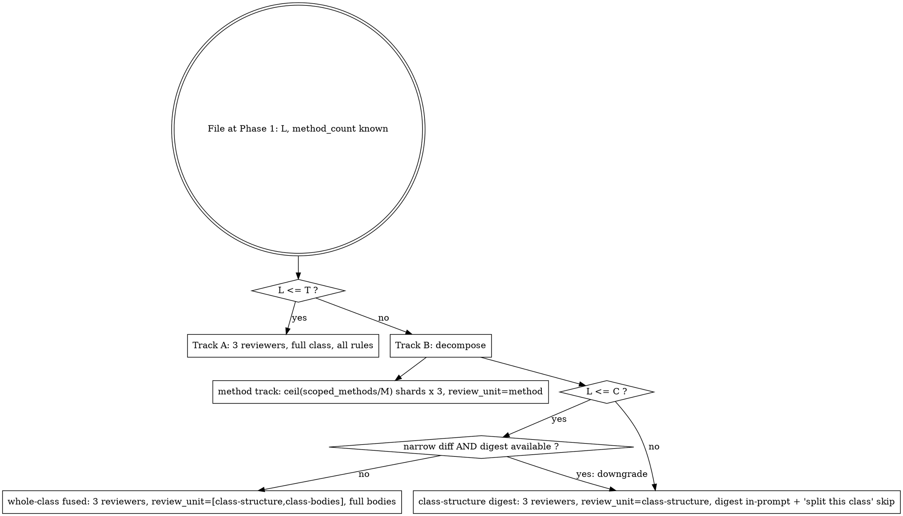

# Reviewer & Adversary Allocation — Adaptation Guide

Allocation is decomposition, not packing: each reviewer carries **one unit** — a Track A file, or one method-shard / whole-class / digest unit of a Track B file — never multiple files in one rule-heavy reviewer. 3 reviewers per unit, 2-of-3 majority, **held per track**; carry a stable `reviewer-{n}` label so a unit's three stances match across waves. The script (`trackOf` / `buildUnits` / `effectiveShards`) owns the allocation; this is the decision mechanism and its adaptation surface.

The same track logic applies to every `test_type`: unit, integration, and migration decompose identically, on shared seed constants, against each file's per-type catalog.

Fixed seeds (every preset): `T=450`, `U_file=18`, `SLOTS=3` (`T` is a **test+source combined** line count). `T` is a reviewability threshold and `SLOTS` is the 2-of-3 consensus invariant — neither is a preset knob.

Preset seeds — the cost/quality operating point, selected by name in the manifest (`preset`), defined in `team-review.workflow.mjs` `PRESETS`, fail-soft to `standard`:

| preset | C | M | lenses (= K_adv) | arbMax | arbFile |
|---|---|---|---|---|---|
| `deep` | 1200 | 6 | 3 | 36 | 6 |
| `standard` (default) | 1000 | 8 | 3 | 24 | 4 |
| `lean` | 800 | 14 | 1 | 6 | 3 |

`C` is the fused → body-free digest combined-line threshold (coverage/token only — no agent-count effect). `M` is max methods per shard (higher → fewer Track-B shards → fewer agents). `lenses` (= `K_adv`) is the per-file adversary count in each of Wave 0 and Wave 2 — the primary agent-count lever; lenses are taken in priority order (§ Adversaries below), L1 (tautology) first, so a single-lens preset keeps the highest-value adversarial check. `arbMax` / `arbFile` are **hard** per-run / per-file caps on arbitrated contested findings — candidates sort must-fix-first at both levels, and every trimmed finding stays contested and visible.

Model combos — body / adversary tiers, selected by name (`models`), defined in `MODEL_PRESETS`: `sonnet-opus` (default), `haiku-opus`, `haiku-sonnet`. Body = reviewers / reconcilers / cross-file / should-fix arbiter; adversary = impressions / red team / must-fix arbiter panel.

## Decision mechanism

Select each file's track at Phase 1 from its combined line count `L` against the fixed constants — never a runtime "will this fit?" estimate.



- **Track A (`L ≤ T`)** — 3 reviewers, full class, all rule groups; pass the manifest method scope when scoped.
- **Method track (Track B, always)** — shard the in-scope methods into groups of ≤ `M`; each shard → 3 reviewers, `methods=[shard]`, `review_unit=method`. Merge = union of shard findings.
- **Whole-class set (Track B, gated on `C`)** — `T < L ≤ C`: fused, 3 reviewers over full bodies, `review_unit=[class-structure, class-bodies]`. `L > C`: structural digest, 3 reviewers, `review_unit=class-structure` (no body read); class-bodies rules are not evaluated and the file emits a "split this test class" skip entry.
- **Narrow-diff downgrade** (`narrowOf`) — on a scoped run whose changed set is ≤ max(3, ¼ of the file's test methods), a fused file reviews the digest instead of the full bodies **when the manifest carries a digest** (extraction computes one above the fixed 800-line floor; below it the fused unit stays). The fixed per-file overhead must scale down when the diff did not touch most of the file. The downgrade never fires without a digest and never adds the "split this test class" entry.
- **Per-file cap `U_file`** — coarsen shards by the fixed formula, never by discretion:
  ```
  shard_cap = ⌊(U_file − 3) / 3⌋   # 5 at the seed constants
  M_eff     = max(M, ⌈scoped_methods / shard_cap⌉)
  shards    = ⌈scoped_methods / M_eff⌉
  ```

## Shard Budget (campaign partition)

The skill partitions the manifest into review shards **before** any launch; each shard is one `mode=review` workflow run.

- **S_max = 250** — the per-shard ceiling on the projected review-mode agent bound. Rationale: measured lean shards of this size ran 161–182 actual agents in ~75 minutes — inside one usage-limit window — and 250 leaves ~4× headroom under the engine's 1000-agent lifetime cap, so even a resume that replays the whole shard plus a full tail re-run cannot reach it.
- **Per-file weight** — from the dry-run projection's `per_file`: `weight = units × SLOTS × 3 + lenses` (the file's share of `review_agents_bound`).
- **Partition** — if the chosen preset's `review_agents_bound` ≤ S_max, one shard. Otherwise round-robin the files by **descending weight** into the fewest shards whose weight sums stay ≤ S_max, so heavy files spread evenly. A file never straddles shards — consensus is per-file.

## What you can adapt

- **Presets (`C` / `M` / `lenses` / `arbMax` / `arbFile`)** — retune the table above in `PRESETS`, or add a named preset. `C` shifts where the whole-class track drops to a body-free digest; `M` is method-shard granularity; `lenses` (= `K_adv`) is adversaries/file in each adversary wave; `arbMax` / `arbFile` are the hard arbitration caps. Lenses are taken in priority order (L1 first); change the lens **set**, not the count alone — `K_adv` must equal the active lens count. Each active lens is one independent adversary reading **exactly that one file**, in both the Wave-0 impression pass and the Wave-2 red team.
- **Model combos** — retune `MODEL_PRESETS`, or add a body/adversary pairing. Keep the adversary tier no lower than sonnet.
- **`T` / `U_file`** — file-decomposition line threshold and the per-file reviewer ceiling (fixed across presets).
- **Targeted widening** (adaptation point 6) — `+2` reviewers for a unit with no majority on most findings, once per unit, while the budget floor holds and the file's total stays ≤ `U_file`.

## Adversaries

Adversary allocation is **per file, not packed**: `K_adv` adversaries cover one file each, one lens each (no file grouping), so an adversary's read accumulation is bounded by a single file. `K_adv` equals the lens count; retune the two together.

## Already handled — do not re-adapt

- The track decision is **static** (line counts known at Phase 1) — do not add a runtime fit estimate.
- The coarsening formula bounds reviewers per file at `U_file`; the changeset is bounded by the campaign's shard plan at `S_max` (with in-run auto-chunking at `G` as a safety net and the `AGENT_BUDGET` pre-flight assert as the hard stop).
- The 2-of-3 consensus invariant holds per track regardless of how a file decomposes.
- A non-unit track whose group has no class-structure / class-bodies rule renders an empty `## RULES` block and yields no findings — safe, not a bug. Do not special-case it; the digest-escape "split this test class" entry still fires.
