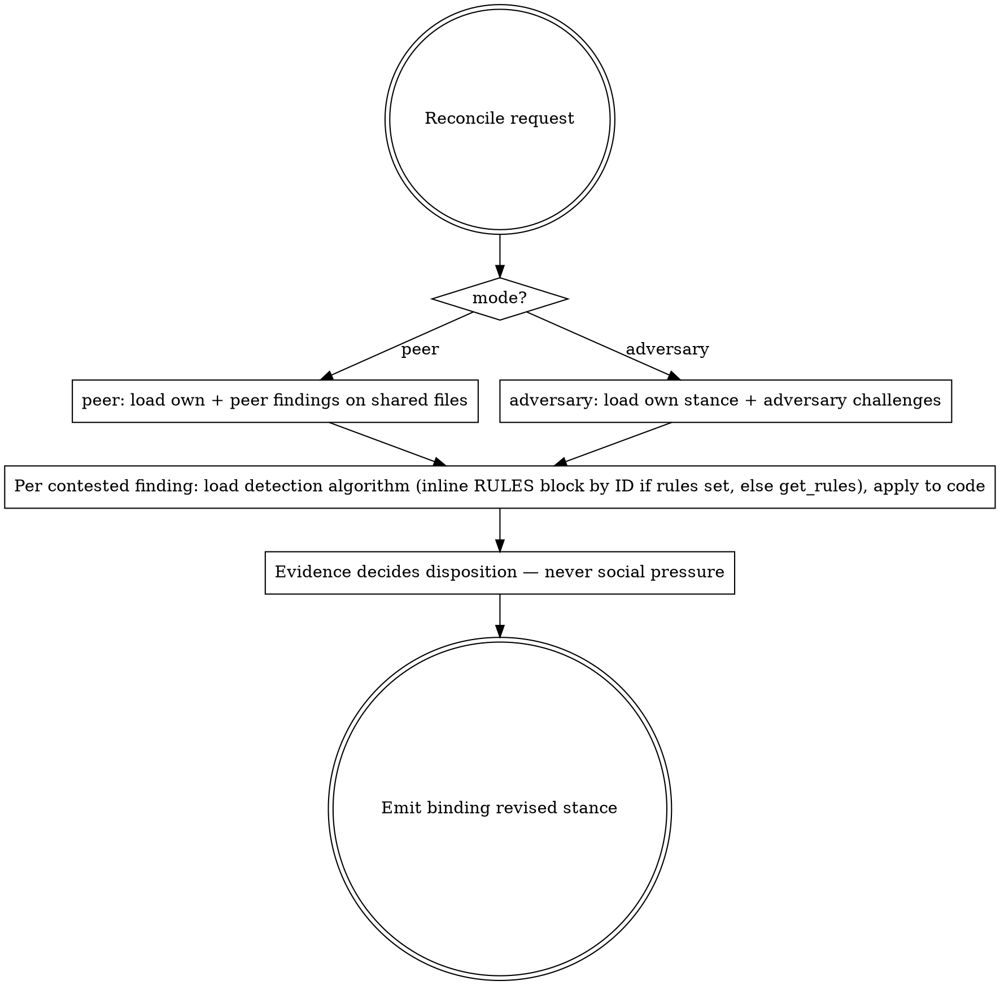

# PHPUnit Test Review Reconciling

Re-evaluate review findings against incoming critique and emit a binding revised stance. Run in one of two modes: `peer` (reconcile against co-reviewers' findings) or `adversary` (reconcile against adversary challenges).

## Input

The spawn prompt provides:

- `mode` — `peer` or `adversary`
- `scope` per file — list of method names, or `full class`. Reconcile only findings within the scoped methods; discard incoming items targeting out-of-scope code.
- `{rules}` (optional) — the pre-rendered rule catalog as text, provided in your prompt. When set, find contested rules by ID in that text; it holds every rule, so **NEVER** read, open, search, or locate a rule file by any means — no `Read`/`Grep`/`Glob`, no `get_rules` — not even to resolve a missing ID. Reading the cited code is unaffected. When omitted, rules load via `get_rules`.

Mode `peer` additionally provides:

- `own_findings` — your findings from the prior wave, per file
- `peer_findings` — co-reviewers' findings on the same files, per file

Mode `adversary` additionally provides:

- `own_stance` — your current binding stance, per file
- `adversary_challenges` — challenges to consensus, resurrections, adversary-introduced findings, and endorsements, per file

## Core Procedure

Load references/reconciliation-rules.md. Apply it to every disposition in both modes.

For each finding under contention:

1. Load the detection algorithm: when `{rules}` is set, find the rule by ID in that inline text; otherwise call `mcp__plugin_test-writing_test-rules__get_rules(ids={rule_id})`.
2. Apply the detection algorithm against the actual code at the cited location
3. Decide the disposition on evidence alone (see mode sections below)

## Mode: peer

Compare own findings against peer findings per file:

- **Shared** (you and a peer both reported) — endorse.
- **Peer-only** (peer reported, you did not) — challenge with a detection-algorithm citation, or concede. Do not add it to your own findings (no new findings in peer mode).
- **Own-only** (you reported, peer did not) — maintain with code evidence, or withdraw if a peer's challenge holds.

Output binding stance per file: `findings` you stand by, and `withdrawn` with reasons. See references/output-format.md.

## Mode: adversary

Evaluate every adversary item per file:

- **Challenge to consensus** — defend with counter-evidence, or withdraw if the adversary's evidence holds.
- **Resurrection** of a finding withdrawn earlier — re-adopt if the adversary's evidence beats your original concession reason; otherwise maintain withdrawal with a strengthened reason.
- **Adversary-introduced finding** — challenge or concede by the same standard as a peer finding. Adopting it is allowed in adversary mode.
- **Endorsement** — no action.

Output binding stance per file with an `adversary_impact` tag on every entry: `findings` (defended | unchanged), `re_adopted` (resurrected), `withdrawn` (overturned), `adopted_new` (introduced). See references/output-format.md.

## Troubleshooting

### MCP Tool Unavailability

If `mcp__plugin_test-writing_test-rules__get_rules` is unavailable, detection algorithms cannot be verified.

- Mode `peer`: concede peer findings you cannot verify; note the limitation in the stance.
- Mode `adversary`: maintain your current positions; note the limitation in the stance.
