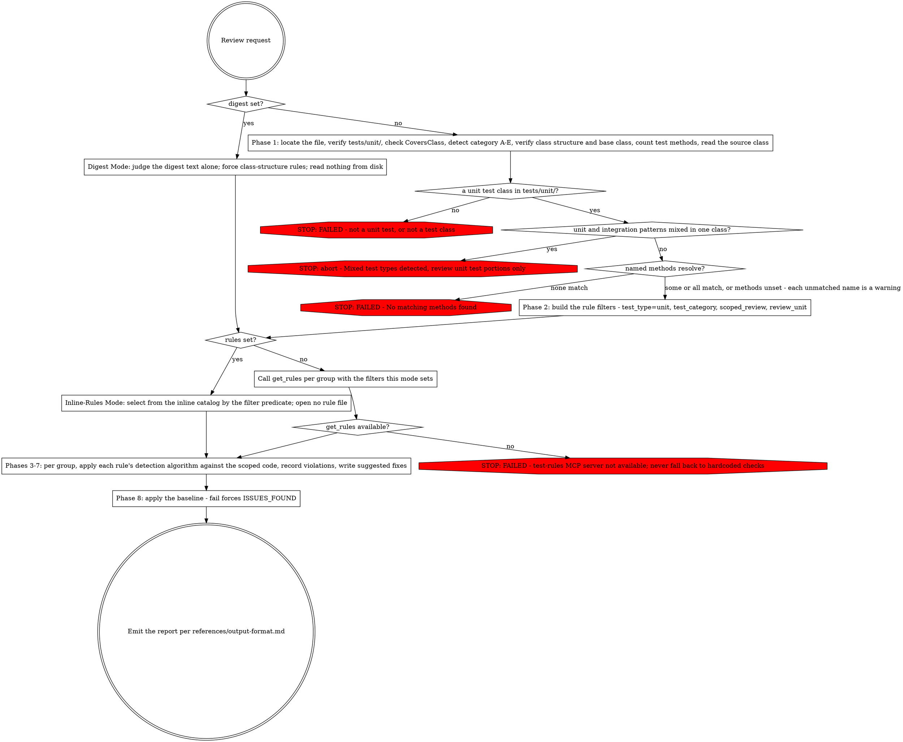

# PHPUnit Unit Test Review

Review a Shopware PHPUnit unit test for compliance with testing guidelines and best practices.

## Input

- `{test_path}` (required unless `{digest}` is set, which supplies the class shape instead) — Path to the test file
- `{methods}` (optional) — List of test method names to scope the review to. When omitted, the full class is reviewed.
- `{review_unit}` (optional) — `method`, `class-structure`, `class-bodies`, or a list of these. When set, only rules whose minimal evaluation unit matches load. When omitted, all rules load. Orthogonal to `{methods}`: both may be set (e.g. `methods=[...]` + `review_unit=method`).
- `{digest}` (optional) — a pre-extracted, body-free structural digest of the test class. When set, review this text and skip reading the test file. Forces `class-structure` rules only. See Digest Mode.
- `{rules}` (optional) — the pre-rendered rule catalog as text, provided in your prompt. When set, enter Inline-Rules Mode: select rules from this text instead of calling `get_rules`. When omitted, rules load via `get_rules`. See Inline-Rules Mode.
- `{baseline}` (optional) — `pass`, `fail`, or `unavailable`: this file's test state before the review, supplied by the caller. Defaults to `unavailable` when omitted. Record and report it; this skill never executes tests to obtain it.

## Workflow



### Phase 1. Identify & Classify

1. Locate test file (by path or `Glob("tests/unit/**/*Test.php")`)
2. Verify in `tests/unit/` directory (abort if `tests/integration/`)
3. Check CoversClass covers exactly one class
4. Determine test category (A-E) per references/test-categories.md
5. Verify class structure order
6. Verify extends `TestCase` or appropriate base class
7. Count test methods (data providers, TestDox, conditionals)
8. Read source class under test (from `#[CoversClass]`) — needed by rules that analyze test-to-code-path coverage
9. If `{methods}` provided: verify each named method exists in the test class. A method that is not found is a warning, and the remaining methods are still reviewed.

### Phase 2. Rule Review Filters

All `mcp__plugin_test-writing_test-rules__get_rules` calls in Phases 3-7 include these shared filters: `test_type=unit, test_category={detected_category}, scoped_review={true if methods provided, omit otherwise}`.

When `{review_unit}` is set, also add `review_unit={value}` to every call. The `review_unit` filter is single-valued per call: for a list (e.g. the fused whole-class track `[class-structure, class-bodies]`), issue one `get_rules` call per value and union the results within each group. When `{review_unit}` is omitted, leave the filter off (all rules load).

### Scoped Review Filtering (Phases 3-7)

When `{methods}` is provided, apply this constraint to ALL rule detection in Phases 3-7:

- Apply detection logic only to the named methods and their associated data providers (identified by `#[DataProvider]` attributes on scoped methods)
- Skip methods not in the scope
- The rest of the class is available for context (e.g., checking if a data provider is shared, understanding import statements) but violations outside the scoped methods are not reported

### Digest Mode

When `{digest}` is set, the supplied text is the only artifact under review:

- Do NOT `Read` the test file or the source class. Detect nothing from disk; the digest is body-free (class declaration, `#[CoversClass]`, member order, method signatures, attribute lines, property declarations) and self-contained for class-structure rules.
- Force `review_unit=class-structure`. In Phases 3-7, call `get_rules(group={group}, review_unit=class-structure)` with NO `test_category` and NO `scoped_review`. Apply whatever rules the filter returns — class-structure rules are category-agnostic, and groups with none return nothing. When `{rules}` is also set, instead select the class-structure rules from the inline text per Inline-Rules Mode (group match + `Review unit` == `class-structure`, no category and no scoped filter).
- Report `location` as a member name or attribute from the digest (line numbers are unavailable without the file body).
- `{methods}` and `{review_unit}` inputs are subsumed: the digest defines the scope and the unit.

### Inline-Rules Mode

When `{rules}` is set, the catalog is provided as text in your prompt: **select** rules from that text instead of calling `get_rules` in Phases 3-7. Each rule in the text is a metadata header — `# {id} — {title}`, then `Group: … | Enforce: …`, then `Test types: … | Categories: … | Scope: … | Review unit: … | Scoped review: …` — followed by the rule body. Per phase, select a rule when ALL hold:

- its `Group` equals the current phase's group, **and**
- the detected category is in its `Categories` CSV, **and**
- if `{review_unit}` is set: its `Review unit` equals that value (for a list, take the union over the values), **and**
- if `{methods}` is set (scoped review): its `Scoped review` is not `exclude`.

Apply each selected rule's detection algorithm exactly as in Phases 3-7. While `{rules}` is set, the inline text is the complete rule set: **NEVER** read, open, search, or locate a rule file by any means — no `Read`/`Grep`/`Glob`, no `get_rules` — not to resolve a rule ID, fetch a detection algorithm, or check for missing content. (Reading the test file and its source class is unaffected — that is required.) When `{rules}` is omitted, rules load via `get_rules` with the Phase 2 filters.

### Phases 3-7. Review Rules by Group

For each group in the table below:

1. Obtain the group's rules: when `{rules}` is set, select them from the inline text per Inline-Rules Mode; otherwise call `mcp__plugin_test-writing_test-rules__get_rules(group={group})` with the Phase 2 filters.
2. For each rule:
   a. Read the rule's Detection/Detection Algorithm sections
   b. Apply the detection logic against the test code (and source class when marked below)
   c. If the rule cross-references other rules, follow the cross-reference
   d. Record violations with the rule's ID, title, and enforce level
3. Generate suggested fixes following each rule's Fix section

| Phase | Group | Covers | + Source class |
|-------|-------|--------|----------------|
| 3 | convention | Naming, attributes, TestDox, assertions, class structure, method ordering | |
| 4 | design | Conditionals, single behavior, test redundancy, data provider usage, coverage distribution | ✓ |
| 5 | unit | Behavior vs implementation focus, mocking strategy, call-count coupling | ✓ |
| 6 | isolation | FIRST principles (Independent, Repeatable), shared state, fixtures, feature flags | |
| 7 | provider | Data provider key quality, naming, yield patterns, TestDox parameters | |

### Phase 8. Generate Report

Apply the pre-review baseline: when `{baseline}` is `fail`, the report opens with a line before `## Summary` stating that this file's tests were already failing before this review, independent of the rule catalog below, and `status` becomes `ISSUES_FOUND` regardless of what the rule catalog finds. When `{baseline}` is `unavailable`, record it in the Summary's `Baseline` field and change nothing else. When `{baseline}` is `pass`, record it in the Summary's `Baseline` field.

For output format and examples, see references/output-format.md.

Report each issue using the rule's ID and title from `mcp__plugin_test-writing_test-rules__get_rules`:
```
### [{rule_id}] {title}
```

Include for each issue:
- **Current Code** — copied verbatim from the file at the cited location, read at review time. Never reconstructed from memory of the rule or paraphrased.
- **Suggested Fix** — the complete method body after the change. Empty only where the remediation deletes the method entirely; `deleted_methods` then names that method.
- **Issue** — names every line present in Current Code and absent from Suggested Fix. Each such line is a removal, and an unnamed removal is a defect in the finding. (The team-review schema names this field `summary`.)

Include full passed checks list.

### Output Contract

```yaml
test_path: tests/unit/Path/To/ClassTest.php
status: PASS|NEEDS_ATTENTION|ISSUES_FOUND|FAILED
baseline: pass | fail | unavailable   # supplied by the caller; recorded and reported, never executed
scope:
  mode: scoped | full
  methods: [method1, method2]  # only when mode=scoped
errors:
  - rule_id: {from mcp__plugin_test-writing_test-rules__get_rules response}
    title: {from mcp__plugin_test-writing_test-rules__get_rules response}
    enforce: must-fix
    location: ClassTest.php:45
    method: testValidatesTotalAgainstThreshold   # the test method the finding is in; "class-level" for a whole-class or structural finding
    current: |
      # problematic code
    suggested: |
      # fixed code
    implies_src_change: false    # true ONLY when the fix cannot be made in the test alone
    deleted_methods: []          # test methods this fix removes ENTIRELY, by bare name; [] when it removes none
    removed_assertions: []       # [{assertion, covered_by_test}] per assertion the fix removes
warnings:
  - rule_id: {from mcp__plugin_test-writing_test-rules__get_rules response}
    title: {from mcp__plugin_test-writing_test-rules__get_rules response}
    enforce: should-fix
    location: ClassTest.php:78
    method: testCountsItems
    current: |
      # code
    suggested: |
      # improved code
    implies_src_change: false
    deleted_methods: [testRedundantEmptyCase]
    removed_assertions:
      - assertion: "static::assertSame(3, $result->count())"
        covered_by_test: testCountsItems      # the surviving test, or the literal "none — coverage lost"
informational:
  - rule_id: {from mcp__plugin_test-writing_test-rules__get_rules response}
    title: {from mcp__plugin_test-writing_test-rules__get_rules response}
    enforce: consider
    location: ClassTest.php:96
    method: class-level
    suggestion: "Optional improvement"
    implies_src_change: false
    deleted_methods: []          # an informational entry whose fix removes test code names it here too
    removed_assertions: []
reason: null                     # the failure text when status is FAILED; null otherwise
```

Every entry names its `method`: the test method the finding is in, or the literal `class-level` for a whole-class or structural finding. `method` is half of a finding's identity (`rule_id|method`), so an omitted or empty value collapses every finding under one rule into the class-level bucket and merges defects that are not the same defect. Never leave it absent, and never write it with a trailing `(...)`.

Set `implies_src_change: true` on a finding whose fix cannot be made in the test file alone — it requires a change under `src/`. Default it to `false`. It is informational: it never changes `status` and never turns a warning into an error.

Informational entries never raise `status`. `PASS` with an informational entry is still `PASS`.

## Troubleshooting

### Ambiguous Category Detection

When test characteristics match multiple categories:
1. Check primary class under test via `#[CoversClass]`
2. Use most restrictive category (D > C > B > A)
3. Exception tests (E) take precedence when `expectException` present

### Mixed Test Types

When a test class contains both unit and integration patterns:
- Abort with message: "Mixed test types detected - review unit test portions only"
- Flag the applicable rule if the test covers multiple classes

### MCP Tool Unavailability

If `mcp__plugin_test-writing_test-rules__get_rules` is unavailable:
- Report error: "test-rules MCP server not available — ensure the test-writing plugin is installed and Claude Code was restarted"
- Do not fall back to hardcoded checks

## Status Values

| Status | Condition |
|--------|-----------|
| PASS | 0 errors, 0 warnings (informational entries do not change status) |
| NEEDS_ATTENTION | 0 errors, 1+ warnings |
| ISSUES_FOUND | 1+ errors |
| FAILED | Invalid input (file not found, not in tests/unit/, not a test class), or a refusal from the deletion after-state check |

A `fail` `{baseline}` sets `ISSUES_FOUND` regardless of this table. A guard refusal sets `FAILED` regardless of this table and of the baseline — `FAILED` outranks every other status — and `reason` carries the tool's error text verbatim.

## Track-Scoped Invocations

The team review decomposes large files into per-track reviews. Each track also receives `{rules}` (the pre-rendered catalog text in its prompt), so rule loading is Inline-Rules Mode selection rather than `get_rules`. Each track sets the inputs below:

- **Method track** — `test_path=…ProductServiceTest.php`, `methods=[testCreates, testThrows]`, `review_unit=method`. The selection predicate becomes `…, scoped_review=true, review_unit=method`; only `method` rules are selected and only the named methods are judged.
- **Fused whole-class track** — `test_path=…`, `review_unit=[class-structure, class-bodies]`, plus `methods=[…]` when the review is scoped (omit for a full-class review). Reads full bodies; selects, per group, the class-structure and class-bodies rules from the inline text and unions them (one selection per `review_unit` value).
- **Class-structure digest** — `digest="<class shape text>"`, no `test_path` read. Per Digest Mode: select the `class-structure` rules from the inline text across groups and judge them against the digest text alone.
