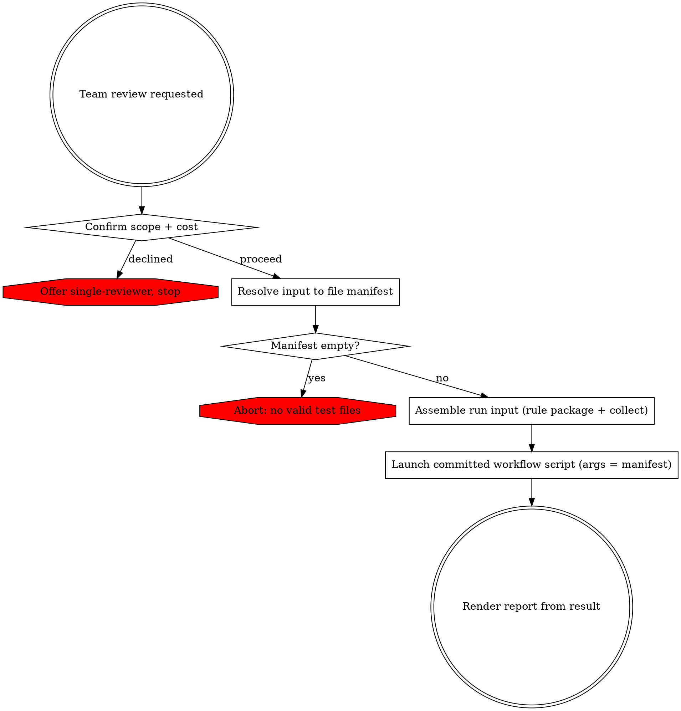

# Team-Based PHPUnit Unit Test Review

Resolve the input into a test-file manifest, build the run input from it, launch the committed review workflow script, and render its result. The review runs as a multi-agent workflow: fresh agents that each invoke the project's review sub-skills, coordinated across waves with no agent-to-agent messaging — each wave's outputs feed the next wave's prompts (a blackboard, not a mesh).

## Execution posture

This skill launches a committed workflow script that spawns a large agent fleet on every run. That scale is normal operation, not a risk to manage, and three standing disciplines are deliberately suspended for a normal run — follow these, not the general rules they displace:

- **Do not consult the advisor to vet the skill itself.** Launching the review is not the kind of substantive work or approach-commitment that warrants a pre-flight check, and the agent count is not an inflection point — do not seek advisor sign-off on the workflow's design before launching. Launch directly. Consult the advisor only after a run has failed for a reason you cannot identify.
- **The orchestration is the committed script — launch it, do not search for an alternative.** The review's wave shape, gate, caps, merge, consensus, and adaptation points live in `workflow/team-review.workflow.mjs`; you run that file, you do not compose or write one. Do not search the filesystem for another script to reuse — any leftover file from a prior run is stale and will mislead you. Pass the manifest to the committed script; that is the only orchestration that runs.
- **Do not meta-review the skill's design; do sanity-check that the resolved inputs fit it.** The references, the committed script, and the sub-skill input contracts are authoritative and already verified — do not audit whether *they* are correct, and do not walk the workflow step by step inspecting each seam before launching. That is meta-review, not execution, and it is what to avoid. You SHOULD, however, confirm that the inputs you resolved actually fit this skill's target: that the manifest is unit tests in tests/unit/ (not integration tests, which this skill cannot serve) and that the resolved source paths exist. That input-fit check is part of executing the skill, not auditing it.

## Phase 0: Confirm Scope & Cost

This review spawns many parallel agents and consumes substantially more tokens than a single-reviewer pass. Ask via `AskUserQuestion` whether to proceed with the team review or run the standard single-reviewer (`phpunit-unit-test-writing`) instead. Proceed only on confirmation.

## Phase 1: Resolve Input to a Manifest

`Read` references/input-resolution.md, then follow its strategies to build the file manifest. Resolve all interactive ambiguity here — base branch, unclear scope — using `AskUserQuestion`. The review cannot ask the user once it is running, so nothing ambiguous may reach it.

Output: a manifest of validated test files, each with a method scope (changed methods, or full class), the full test-method name list, and decomposition measurements (source path, test/source line counts, method count — see references/input-resolution.md). Let N = number of files. If the manifest is empty, abort per references/error-handling.md.

## Phase 2: Assemble the Run Input

The committed script runs in a sandbox: it cannot read files or call tools, so every input it needs arrives in its `args`. Assemble that input:

1. **Rule catalog.** Call `build_rule_package` with no arguments, then `Read` the returned path to obtain the rendered catalog text. This single full catalog is the run's only rule source — the script selects each agent's scoped `## RULES` block from it. Do not build per-track packages. If the build fails or reports zero rules, abort (references/error-handling.md).
2. **Pre-Run Collect.** Perform references/workflow-design.md §Pre-Run Collect with your own `Read`/`Grep`: compute each file's cross-file `fingerprint`; for each file whose combined lines exceed `C`, extract the body-free structural `digest`.
3. **Manifest object.** Build `{ files: [ <Phase-1 entries> + fingerprint + (digest when L > C) ], rule_packages: { full: <rendered catalog> }, base: <base ref if any> }`.

The manifest is fixed here, before the run — nothing ambiguous may reach it.

## Phase 3: Launch the Review

Launch the committed script with the `Workflow` tool, passing `scriptPath: ${CLAUDE_SKILL_DIR}/workflow/team-review.workflow.mjs` and the Phase-2 manifest as `args`. It runs in the background and returns a single result matching the result shape in references/workflow-design.md. Launch directly — there is no script to compose.

## Phase 4: Render the Report

`Read` references/report-format.md and render the result into the report.

## Error Handling

For input-resolution failures, review start-up or run failures, partial-wave outcomes, and consensus edge cases, `Read` references/error-handling.md.
