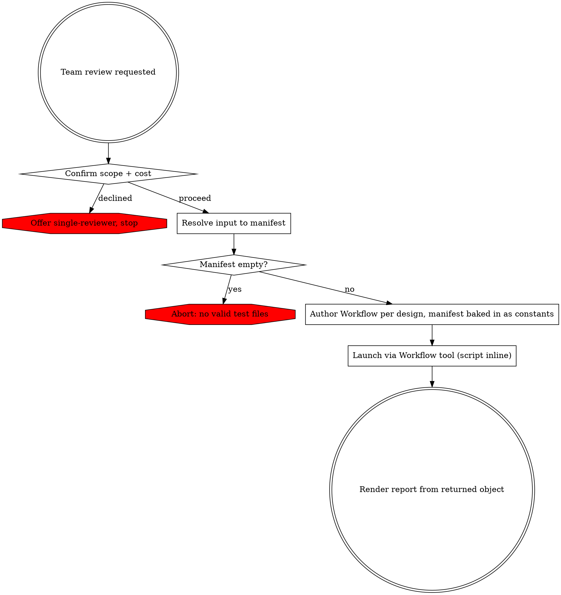

# Team-Based PHPUnit Unit Test Review

Resolve the input into a test-file manifest, author a multi-agent review Workflow adapted to that manifest, launch it, and render its result. The review runs as a Workflow: deterministic orchestration over fresh, schema-constrained agents that invoke the project's review sub-skills.

## Phase 0: Confirm Scope & Cost

This review spawns many parallel agents and consumes substantially more tokens than a single-reviewer pass. Ask via `AskUserQuestion` whether to proceed with the team review or run the standard single-reviewer (`phpunit-unit-test-writing`) instead. Proceed only on confirmation.

## Phase 1: Resolve Input to a Manifest

`Read` references/input-resolution.md, then follow its strategies to build the file manifest. Resolve all interactive ambiguity here — base branch, unclear scope — using `AskUserQuestion`. The Workflow cannot ask the user once launched, so nothing ambiguous may reach it.

Output: a manifest of validated test files, each with a method scope (changed methods, or full class). Let N = number of files. If the manifest is empty, abort per references/error-handling.md.

## Phase 2: Author the Workflow

`Read` all of the following, then author one Workflow script implementing the design:

- references/workflow-design.md — base wave shape, adaptation points, authoring constraints, returned-object shape
- references/reviewer-allocation.md — how many reviewers and adversaries, and how files are packed per agent
- references/agent-guardrails.md — the prompt contract for every spawned agent
- references/red-team-context.md — red-team skip conditions and the context package adversaries receive
- references/consensus-and-verdicts.md — consensus merge, cross-file consistency wave, status, adversary-impact

Bake the resolved manifest and the counts derived from it into the script as constants. Do not pass them as workflow args.

## Phase 3: Launch

Launch the authored script with the `Workflow` tool, passing the script inline. The Workflow runs in the background and returns a single object matching the returned-object shape in references/workflow-design.md.

## Phase 4: Render the Report

`Read` references/report-format.md and render the returned object into the report.

## Error Handling

For input-resolution failures, workflow launch or run failures, partial-wave outcomes, and consensus edge cases, `Read` references/error-handling.md.
