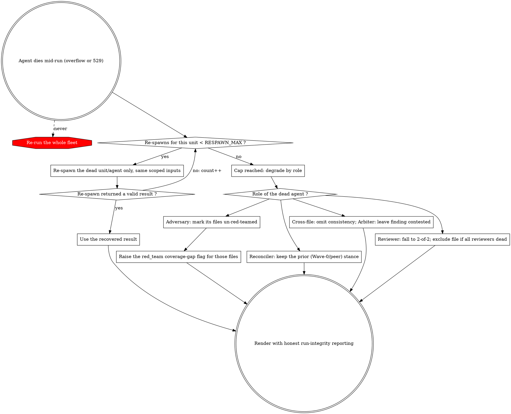

# Error Handling

## Input Resolution Failures

These abort **before** the run starts — the fail-hard guard, distinct from the mid-run recovery below.

| Scenario | Action |
|---|---|
| 0 files resolved | Abort before the review starts. Report strategies tried and why each produced no results. |
| Some files missing `#[CoversClass]` | Exclude those files, continue with the rest. Report excluded files. |
| A surviving file's `#[CoversClass]` source cannot be resolved | Abort before the review starts — the source line count is required for the track decision; never guess it. Report the unresolved file. |
| All files excluded after validation | Abort before the review starts. Report validation failures per file. |

## Mid-Run Agent Death — Recovery

A single agent dying mid-run (a "Prompt is too long" overflow or a transient `529 Overloaded`) is **not** a run failure and **never** triggers a whole-fleet re-run. Re-spawn the dead unit/agent up to `RESPAWN_MAX`; only when that is exhausted does the role's graceful degradation apply, and any lost adversary coverage is flagged — never hidden.

### Re-spawn (first recourse)

When an agent dies, re-spawn **only that unit/agent**, with the same scoped inputs (its `## RULES` package, scope, and wave context) — never the rest of the fleet. Cap at `RESPAWN_MAX` attempts per unit. Use a valid re-spawn result as the original.

### Degrade by role (after re-spawn is exhausted)

Only after a unit burns `RESPAWN_MAX` does its role's graceful degradation apply: every loss is either covered (reviewer 2-of-2) or **loudly flagged** (adversary coverage gap).

| Dead role (after re-spawn) | Action |
|---|---|
| Some reviewers of a file | Fewer than 3 stances remain → use the Consensus Edge Cases below (2-of-2, reduced confidence). |
| All reviewers of a file | Exclude that file; report it as unreviewed. |
| An adversary | Mark its files **un-red-teamed** and raise the `red_team` coverage-gap flag for them — never substitute peer stances as if adversarial coverage were complete. |
| A defense reconciler | Keep that reviewer's peer stance; the adversary challenges have no effect on it. |
| The cross-file agent | Omit the consistency section; note it in the report. |
| An arbiter | Leave the finding contested; do not include it in the body. |

### Adversary-coverage gate

Track which in-scope files were actually red-teamed. After all re-spawns settle, if any in-scope file was **not** red-teamed, the result's `red_team` must carry a prominent **coverage-gap flag** naming those files — never paper over it with peer stances.

## Run Failures

| Scenario | Action |
|---|---|
| Workflow tool unavailable / cannot start | Inform the user the multi-agent review could not start; offer the single-reviewer skill (`phpunit-unit-test-writing`). |
| Run aborts on the fail-hard guard (empty manifest, missing field) | This is the intended guard. Fix the manifest and run again; never re-run on empty input. |
| A single agent errors mid-flight | Not a run failure — see Mid-Run Agent Death (re-spawn that unit, never the whole fleet). |
| The whole run aborts mid-flight | Prefer resuming the interrupted run so completed work and the re-spawn budget are not discarded; re-run from scratch only when resume is unavailable. |

## Consensus Edge Cases

| Scenario | Action |
|---|---|
| File has only 2 valid stances | 2-of-2 voting: both agree → include; disagree → contested. Note reduced confidence. |
| File has only 1 valid stance | Include all findings with the annotation "Single reviewer — no consensus possible." |
