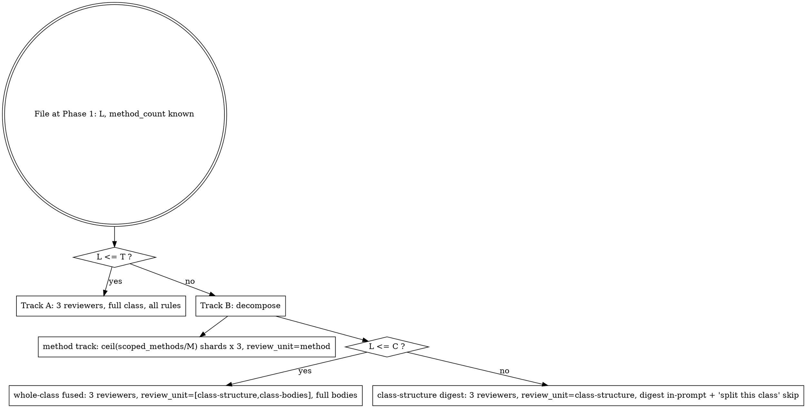

# Reviewer & Adversary Allocation

Allocation is decomposition, not packing. Each reviewer agent carries **one unit** — one Track A file, or one method-shard / whole-class unit of a Track B file. Never bundle multiple files into one rule-heavy reviewer, at any N.

Constants used here (seed values, frozen — full table in workflow-design.md): `T=450`, `C=800`, `M=8`, `K_adv=6`, `U_file=18`. `T`/`C` are **test+source combined** line counts.

## Consensus Invariant

Findings are decided by **3 independent reviewers, 2-of-3 majority** — held **per track**: 3 per method-shard, 3 for the whole-class set, 3 for the class-structure digest. Each wave spawns fresh agents; carry a stable `reviewer-{n}` label in prompts and outputs so a unit's three stances match across waves.

## Per-File Track Decision

Select each file's track at Phase 1 from its line count `L` against fixed constants — never from a runtime "will this fit?" estimate. `L`, `method_count`, and the method scope are all resolved before the run (input-resolution.md).



### Track A — `L ≤ T`

3 reviewers, one file each, all rule groups, no `review_unit`, no sharding. Method scope behaves as in a single-reviewer pass: pass the manifest's method scope when the review is scoped, full class otherwise. The common path, unchanged.

### Track B — `L > T`

Two reviewer populations always run; a third is gated on `C`. Each reviewer loads only its track's rules via `review_unit` (reviewing sub-skill input).

- **Method track (always).** Shard the **in-scope** test methods (the manifest's method scope, or all test methods when full-class) into groups of ≤ `M`. Each shard → 3 reviewers, scoped to that shard's methods (`methods=[…]`), `review_unit=method`. Merge = union of shard findings.
- **Whole-class set, gated on `C`:**
  - `T < L ≤ C` — **fused**: 3 reviewers over full bodies, `review_unit=[class-structure, class-bodies]` plus the manifest method scope when scoped (one combined whole-class set; the bodies subsume the digest).
  - `L > C` — **digest + escape**: 3 reviewers over the pre-extracted structural digest, `review_unit=class-structure` (Digest Mode — no body read). The class-bodies rules are **not evaluated**; emit the "split this test class" skip entry (consensus-and-verdicts.md). The digest track still runs, so structural findings are still produced.

### Per-File Reviewer Cap `U_file`

Total reviewer agents for any single file ≤ `U_file` (= 3·⌈scoped_methods/M⌉ + 3 whole-class + widening). When the base count would breach it, coarsen the shard size by the fixed formula — never by discretion:

```
shard_cap = ⌊(U_file − 3) / 3⌋          # = 5 at the seed constants
M_eff     = max(M, ⌈scoped_methods / shard_cap⌉)
shards    = ⌈scoped_methods / M_eff⌉    # ≤ shard_cap, so base = 3·shards + 3 ≤ U_file
```

Widening (below) fires only while the file's total stays ≤ `U_file`.

## Adversary Packing

`adversaries = ⌈N / K_adv⌉`, contiguous partition (adversary 0 gets the first block, and so on), ≤ `K_adv` files each, every file covered by exactly one adversary. Impressions skip the catalog, so the per-agent file cap is higher than a reviewer's.

## Targeted Widening (adaptation point 6)

When a contested **unit** (method-shard or whole-class set) shows no majority on most findings, or more contested than agreed findings, spawn **+2 reviewers for that unit only, once per unit**, while the budget floor holds and the file's total stays ≤ `U_file`. Re-merge that unit with the enlarged set.

## Agent-Count Guard

The changeset-level projection (`Σ per-file reviewers`) is bounded by auto-chunking at `G` — see input-resolution.md (projection + chunk plan) and workflow-design.md (how chunks compose with the waves).
