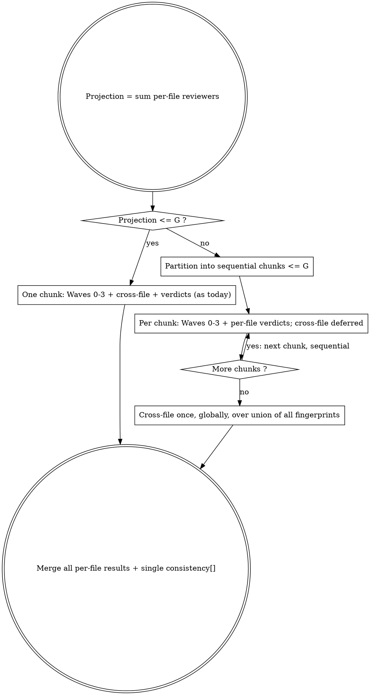

# Workflow Design

The review runs as fresh agents coordinated across waves. Agents never message each other; one wave's outputs are routed into the next wave's prompts (a blackboard, not a mesh). Each agent gets a narrow prompt and returns one result matching the field contract for its role.

## Pre-Run Collect (composition-time, deterministic)

For each **Track B** file, extract two artifacts during composition (the orchestrator's own `Read`/`Grep`, before the run starts) and pass them into the run as fixed agent-prompt data — never produced by a spawned agent (an agent would `Read` the bodies and defeat the digest):

- **Structural digest** — class declaration, `#[CoversClass]`, member order, method signatures, attribute lines, property declarations. **No method bodies.** Routed in-prompt to that file's class-structure reviewers (Digest Mode of the reviewing sub-skill); used only on the `L > C` digest track.
- **Cross-file fingerprint** — a fixed-size structural signature: `setUp` shape, mock strategy (createMock/createStub), assertion style, data-provider style, attribute order. Computed for **every** file (Track A and B). Routed to the cross-file agent.

Once per run (not per file), build one more artifact:

- **Rule package** — build the unit-review rule catalog once via the `build_rule_package` tool; it returns the path to the rendered package. `Read` that path **once** (the orchestrator's own `Read`, before the run) to obtain the rendered catalog text, then pass that text into the run as fixed agent-prompt data — injected verbatim into every reviewing, reconciling, adversary, and arbiter agent prompt under a `## RULES` heading. **Never pass the file path to a spawned agent**; spawned agents must **NEVER** read, open, search, or locate any rule file by any means — native tool or terminal command (`ugrep`, `bfs`, `grep`, `find`, `cat`, …) — nor call `get_rules` (agent-guardrails.md). They still read the test file and its source class; only rule files are off-limits. Removing the path is the structural guarantee; the inline `## RULES` block plus the guardrail prohibition is the backstop. The catalog is built and read once, never re-fetched per agent. If the build fails or reports zero rules, abort the review (Design Constraints — Fail hard).

## Base Wave Shape

The default flow, in order. Several waves are conditional — see Adaptation Points.

1. **Wave 0 — Independent review + impressions (parallel).**
   - Reviewer agents review the manifest **units** independently (each invokes the reviewing sub-skill). A unit is a Track A file, or one of a Track B file's method-shards / whole-class set / class-structure digest (reviewer-allocation.md). Each reviewer carries one unit and loads only its track's rules via `review_unit`. Honor the consensus invariant per track: 3 reviewers per unit.
   - Adversary agents form independent impressions of their assigned files (no consensus exposure yet).
   - All Wave 0 agents run concurrently.

2. **Collect & assemble (deterministic).** Group findings per file (across its tracks). For each reviewer, assemble the peer-findings package: co-reviewers' findings on the unit that reviewer shares.

3. **Wave 1 — Peer reconciliation (parallel, gated per unit).** A unit whose three Wave-0 stances all carry zero findings has nothing to reconcile: skip its reconciliation and carry its three empty stances forward unchanged as binding input to the preliminary consensus — no agent is spawned for a skipped unit. Every other unit reconciles as today: each reviewer reconciles its findings against peers' findings (invokes the reconciling sub-skill in peer mode) and returns a revised binding stance per file. Skip a unit **only when all three** stances are empty — a single reviewer finding obliges the other two to weigh it, so the unit reconciles. The skip is deterministic from Wave-0 outputs.

4. **Preliminary consensus (deterministic).** Merge each unit's binding stances — reconciled in Wave 1, or carried forward unchanged for skipped units — per file into a preliminary consensus (2-of-3 majority). Compute the red-team skip signal; skipped units do not affect the concession rate (they contribute no Wave-0 findings and no withdrawals).

5. **Wave 2 — Red team (conditional).** Adversary agents challenge the preliminary consensus (invoke the adversarial-reviewing sub-skill) using the consensus package plus their Wave 0 impressions. Return challenges, resurrections, adversary-introduced findings, and endorsements.

6. **Wave 3 — Defense (conditional).** Each reviewer whose files drew challenges reconciles its stance against those challenges (invokes the reconciling sub-skill in adversary mode). Returns a revised stance with an adversary-impact tag on every entry.

7. **Cross-file consistency (dedicated agent).** One agent receives every file's **fingerprint** (the fixed signature from Pre-Run Collect) — not full consensus findings — plus any cross-file inconsistencies the adversaries surfaced as candidate signals, and hunts pattern divergence across files (setUp strategy, mocking, assertions, data providers, attribute ordering). Input is `N × small-constant`. Above `F_cap` (= 40) files, shard this agent by **pattern dimension** (one agent per signature axis) and merge. Runs **once per review**, globally across chunks (see Chunked Runs). Sole producer of cross-file findings — individual reviewers do not emit them.
   - **Lost capability (recorded, not hidden):** fingerprints are structural-only, so this agent correlates structural patterns, not finding bodies. It never used finding bodies for divergence detection (the fingerprint axes are exactly what it compares), so this is acceptable — but it no longer correlates cross-file *findings*.

8. **Verdicts (deterministic).** Per-file cross-track merge then consensus merge (consensus-and-verdicts.md), status determination, adversary-impact assembly, the `decomposition[]` audit, and the result.

## Chunked Runs

The auto-chunk guard (input-resolution.md) partitions the manifest when the reviewer projection exceeds `G` (= 300). Chunking must never blind the cross-file analysis — the cross-file pass runs **once, globally**, after all chunks.

Chunks run **sequentially**, so peak in-flight agents stay bounded by `G`. Launch granularity: keep chunks inside one workflow run while the lifetime agent total stays under the Workflow 1000-agent cap; above that, launch chunks as sequential workflow runs and merge their results. A small changeset (projection ≤ `G`) runs as one chunk — no behavior change.

## Parameters Fixed Before the Run

Decide these once, before the review runs, from the resolved manifest and its measurements:

- Per-file track (A or B) and, for Track B, the method-shard count and whole-class/digest branch — all from the Phase-1 line counts (reviewer-allocation.md).
- Adversary count (`⌈N / K_adv⌉`) and the chunk plan (input-resolution.md).
- Model tier per agent role (tiers under Design Constraints below) — pinned explicitly on each spawn, never inherited.

### Constants (seed values, frozen)

| Constant | Meaning | Seed |
|---|---|---|
| `T` | Combined test+source lines above which a file is decomposed | 300 |
| `C` | Combined lines above which the whole-class track becomes the digest-only escape | 800 |
| `M` | Max test methods per method-shard | 8 |
| `K_adv` | Max files per adversary impression agent | 6 |
| `U_file` | Max reviewer agents per single file (all tracks + widening) | 18 |
| `G` | Max reviewer agents per chunk (auto-partition above this) | 300 |
| `F_cap` | Files the cross-file agent ingests before sharding by pattern dimension | 40 |

Per file, resolved at Phase 1: `(test_lines, source_lines, method_count)` and the method scope.

## Adaptation Points

These are the points where the review's shape changes at runtime. Build each one in: an agent returns a steering signal as part of its result, the design branches on it, and a concrete cap bounds it. Never leave a cap to runtime discretion.

| # | Steering signal | Branch / loop rule | Hard cap |
|---|---|---|---|
| 1 | Per-file line counts + N, known before the run | Fix each file's Track A/B granularity, method-shard count, the `L > C` digest-escape branch, adversary count, chunk plan, and model tiers — all from known line counts, never a runtime "would it fit" reaction | Fixed by the allocation reference; not a runtime loop |
| 2 | Computed deterministically: preliminary consensus has zero findings, OR peer reconciliation already withdrew a large share of the Wave-0 findings (concession rate ≥ 0.5) | Skip Wave 2 + Wave 3; go straight to verdicts | Single conditional; never both run when the signal says skip |
| 3 | Computed deterministically: after the Wave-1 merge, shared files still carry non-unanimous (contested or split) findings | Run one additional peer-reconciliation pass, seeded with the updated peer stances | **Max 2 peer passes total**; stop as soon as the merge has no contested findings |
| 4 | Adversary returns resurrections or adversary-introduced findings | Route them into Wave 3 so the owning reviewer can re-adopt or adopt | Bounded by the adversary output; no loop |
| 5 | A finding is contested after merge (reported by only 1 of 3), OR a must-fix was overturned in defense, OR stances split with no majority | Spawn one arbiter agent for that finding; it re-reads the code and settles it | One arbiter per contested finding; no arbiter when consensus is clean; opus for must-fix/critical, sonnet otherwise |
| 6 | A unit's reviewers diverge sharply (a method-shard or whole-class set: no majority on most findings, or contested count exceeds agreed count) | Spawn extra reviewers for that unit only, then re-merge that unit | **At most +2 reviewers per unit, once per unit**; only while the budget floor holds and the file's total stays ≤ `U_file` |

Points 2–4 are the base review loop. Points 5–6 are enhancements — include them, but they fire only on their signals; a clean review never spawns an arbiter or an extra reviewer.

## Design Constraints

- **Fail hard.** If the manifest is empty, any entry is missing its path or scope, or a Track B file's source size is unresolved, the review must abort — never run on incomplete input and return a hollow report.
- **Surface the resolved scope first.** The run announces file count, per-file track, the reviewer projection, adversary count, the chunk plan, and the model tier per role up front, so it is auditable at a glance.
- **Model tier per role.** Reviewers, adversaries, reconcilers, and the cross-file consistency agent run on **sonnet**; the arbiter (point 5) runs on **opus** for must-fix/critical findings, sonnet otherwise.
- **Pin the model on every spawn — never inherit.** Each agent's model is fixed before the run and set explicitly on its own spawn. An agent spawned without an explicit model inherits the session/default model — possibly a different tier — and that is a defect, not a default. Agent type and model are orthogonal: the read-only agent type supplies the tool set and the no-write guarantee, not the model. No agent type maps to opus, so the arbiter's opus tier can come *only* from its explicit spawn — the same mechanism that pins every other agent's sonnet.
- **Read-only review agents.** Spawn reviewers and adversaries through the read-only agent types; they must not write files.
- **Constrain every agent's output** to the field contract defined for its role.
- **Concrete guards only.** Every cap is a fixed number — `T`, `C`, `M`, `K_adv`, `U_file`, `G`, `F_cap`, max 2 peer passes, +2 reviewers per unit — never "a reasonable cap". A budget floor checked before any conditional wave. No discretionary caps.
- **Keep it simple.** Prefer parallel fan-out and conditional waves. Use loops or extra waves only for the bounded adaptation points above.

## Result Shape

The review produces one result the rendering step consumes directly:

- `summary` — files reviewed, reviewer count, overall status.
- `files[]` — per file: status, category, the reviewers/slots used, `errors` / `warnings` / `informational` (each finding carries consensus level, adversary-impact tag, dissent if majority, and any arbitration verdict), `contested[]`, and a consensus tally.
- `consistency[]` — cross-file divergences from the dedicated cross-file agent.
- `decomposition[]` — per file: track (A / B), method-shard count, whole-class branch (fused / digest-escape), and any "split this test class" skip — so the decomposition is auditable.
- `red_team` — skipped flag and skip reason, or the challenge/defense metrics.
- `adaptation` — which adaptation points fired this run (extra peer pass, extra reviewers per contested unit, arbiters spawned) and the count of units whose Wave-1 reconciliation was skipped for carrying zero Wave-0 findings, so the run is transparent.
